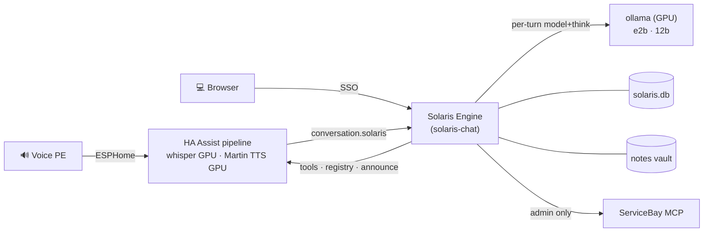

# Solaris

**Solaris** is a household AI assistant that ServiceBay deploys as one
click. Its core is the **Solaris Engine** — a native agent loop inside
`solaris-chat` that talks directly to a local Ollama, controls the home via
Home Assistant, and fronts the Voice PE speaker through HA's Assist
pipeline. (The earlier Hermes-gateway architecture was fully replaced in
v0.10 — see `solaris-architecture.md` for the full picture and flows.)



A spoken command answers in ≈1.3 s after speech end (whisper GPU 0.38 s +
engine ≤1 s); the household prompt is ~2.1k tokens with the HA entity
registry injected.

## What's in this repo

- **Solaris Engine + chat surface** (`solaris-chat/`) — one process owning the
  agent loop (direct Ollama `/api/chat`, per-turn model + reasoning), the
  session store (`solaris.db`), native LLM tracing, the timer scheduler
  (speaker delivery via `assist_satellite.announce`), the night crons, the
  chat UI, and the Ollama-compatible facade HA's conversation agent calls.
  Built into `ghcr.io/mdopp/solaris-chat:latest`.
- **Skill packs** (`templates/solaris/skills/`) — markdown procedure packs
  the engine folds into its prompts: `household/` (incl. the cron-job
  bodies `daily-chronicle`, `problem-summarizer`) and `admin-soul/` (the
  operator persona: `admin-diagnose`, `admin-logs`, `admin-act` + its
  `SOUL.md`).
- **ServiceBay templates** (`templates/{ollama,solaris}/`) — two services:
  `ollama` (the local LLM engine) and `solaris` — one Pod with the `chat`
  (engine) and `gatekeeper` containers. `post-deploy.py` seeds the soul,
  adopts the HA token, wires the **voice pipeline** (wyoming whisper/piper,
  the Solaris conversation agent, the Assist pipeline on the Voice PE) and
  mints the `servicebay_admin` MCP token.
- **Solaris stack** (`stacks/solarisbay/stack.yml`) — bundles the two
  templates so a ServiceBay operator can install with one click.
- **Voice gatekeeper image source** (`voice-gatekeeper/`) — Python
  Wyoming-protocol bridge for wyoming-satellite hardware (the Voice PE
  itself rides HA's Assist pipeline); turns run against the engine's
  facade. Built into `ghcr.io/mdopp/solaris-gatekeeper:latest`.
- **Database image source** (`database/`) — Alembic schema-init container
  that runs `alembic upgrade head` against `solaris.db` on every pod
  start. Built into `ghcr.io/mdopp/solaris-schema-init:latest`.

## Install

1. ServiceBay → Settings → Registries → Add `mdopp/solarisbay`
   (`https://github.com/mdopp/solarisbay.git`).
2. After save, the `ollama` + `solaris` templates and the `solarisbay` stack
   appear in the wizard.
3. Install the stack. The `solaris` template's `post-deploy.py` does the
   rest (soul, HA token adoption, jellyfin integration, voice pipeline,
   admin MCP token).

## Repository layout

```
solarisbay/
├── README.md                       # this file
├── solaris-architecture.md         # the architecture record
├── templates/                       # ServiceBay templates
│   ├── ollama/                       # the local LLM engine — its own service
│   └── solaris/                      # the assistant service
│       ├── template.yml             # one Pod: chat (engine) + gatekeeper
│       ├── post-deploy.py           # soul + HA wiring + admin MCP token
│       ├── variables.json
│       └── skills/
│           ├── household/           # household skill pack (engine prompts)
│           └── admin-soul/          # operator skill pack + SOUL.md
├── solaris-chat/                   # Docker image source (the Solaris Engine)
├── voice-gatekeeper/               # Docker image source (Wyoming bridge)
├── database/                       # Docker image source (alembic)
├── stacks/
│   └── solarisbay/
│       └── stack.yml               # templates: [ollama, solaris]
└── .github/workflows/
    └── build-images.yml            # publishes the GHCR images
```

## Image build

`.github/workflows/build-images.yml` publishes
`ghcr.io/mdopp/solaris-chat`, `ghcr.io/mdopp/solaris-gatekeeper` (+ `-ml`)
and `ghcr.io/mdopp/solaris-schema-init` on release tags (`v*`, via
release-please) and pushes to `main`.

## License

MIT. See [LICENSE](LICENSE).
