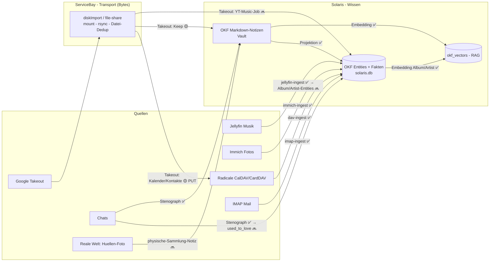

# Solaris — Datenquellen, Datenziele & Fähigkeiten

Diese Seite ist die selbst-erklärende Übersicht: **welche Datenquelle** fließt über
**welche Fähigkeit** in **welches Wissens-Ziel** — damit auf einen Blick klar ist,
*was Solaris kann*. Die verbindlichen Regeln dahinter stehen in den
[ADRs](adr/README.md).

Verwandte Issues: Epic **#860** (Google-Takeout-Import), **#873** (Musik/OKF-Substrat),
**#868** (Musik-Job), **#859** (Enrichment-Rework).

---

## 1. Anforderungen (konsolidiert)

**A — Google-Takeout-Import (Epic #860)**
- **A1** Standalone-Tool *in* Solaris falten; mechanischen Kern als vendored Lib nutzen; Standalone-Service am Ende retiren.
- **A2** Kategorien: Kalender (`.ics`→CalDAV), Adressbuch (`.vcf`→CardDAV), Keep-Notizen (→Vault-Markdown), YouTube-Music-History (→Wunsch-/Einkaufsliste).
- **A3** Generisch + erweiterbar: `Importer`-Protokoll + Registry; künftige Quellen (Apple/Spotify/Ordner) und Kategorien (Photos→Immich, Mail→IMAP) stecken sich an. *Transport bleibt bei ServiceBay `diskImport` — siehe [ADR 0001](adr/0001-import-transport-vs-semantics.md).*
- **A4** LLM ersetzt die Seed-Katalog-Klassifikation (Hörspiel/Podcast); mechanische Guards bleiben; „lieber unaufgelöst als falsch".
- **A5** Durable, resumierbare, owner-scoped Import-Jobs in `solaris.db`.
- **A6** Upload: vorhandenen Vault-Upload-Kern generalisieren (kein Parallel-Endpoint), `.zip` + Browser+Device.
- **A7** Frontend nicht überfrachten: kein neuer Tab; Action-Card-Flow; ein Posteingang-Modell. Siehe [ADR 0007](adr/0007-frontend-no-new-surface.md).

**B — Musik/OKF-Substrat (#873)**
- **B1** Nicht doppelt halten. Extern re-ingestierbar (Jellyfin/Immich) → nur SQLite-Projektion, kein Per-Item-Markdown, Embeddings nur auf Album/Artist-Ebene.
- **B2** Selbst-entstanden (physische Sammlung + Foto, „früher gern gehört", persönliche Fakten, Keep-Notizen) → echte Notiz (Markdown = Truth).
- **B3** Ein Album/Artist = eine Entity; quellen-getaggte Fakten (`has_digital`/`owned_physical`/`wishlist`/`used_to_love`/`source`). Siehe [ADR 0003](adr/0003-one-entity-source-tagged-facts.md).
- **B4** Einkaufs-/Wunschliste = Query über Fakten, kein materialisiertes Markdown. Siehe [ADR 0004](adr/0004-derived-lists-are-queries.md).
- **B5** Physische Sammlung: reale Platten/LPs/Kassetten mit Hüllen-Foto erfassen; Ziel Digitalisieren + erinnern, was ich früher gern hörte.
- **B6** Album-Entity einführen (existiert heute nicht — Album ist nur ein String am Song).
- **B7** Alte Per-Song-Markdowns prunen.
- **B8** Möglichst ohne Album-Cover (keine Cover-Art materialisieren; Bild = nur das selbst fotografierte Hüllen-Foto). Siehe [ADR 0005](adr/0005-lean-rag-no-cover-art.md).
- **B9** Chat-Infos (Stenograph aus Gesprächen) → Fakten an Song/Album oder spezielle Notizen.
- **B10** RAG bleibt sinnvoll: semantische Suche auf Album/Artist + persönlichen Notizen, statt auf tausenden Song-Stubs.

**C — Querschnitt**
- **C1** Durchgängig per-Resident-`uid`-Scoping (OKF-Contract).
- **C2** Release-Disziplin (release-please; das Wegwerf-Notiz-Modell nicht ausliefern).
- **C3** Path-mandated Changes auf der Box verifizieren.

---

## 2. Capability-Map

Legende: ✅ vorhanden · 🟡 gebaut (noch nicht released) · 🔜 geplant

---

## 3. Kanten = Fähigkeiten (Ist-Stand)

| Von → Nach | Fähigkeit | Status |
|---|---|---|
| Jellyfin → Entities | `jellyfin-ingest` (heute Song+Band; **Ziel:** Album/Artist-Entities + Fakten) | ✅ → 🔜 (B6) |
| Immich → Entities | `immich-ingest` | ✅ |
| Radicale → Entities | `dav-ingest` (`caldav`/`carddav`) | ✅ |
| IMAP → Entities | `imap-ingest` | ✅ |
| Vault → Entities | `obsidian-ingest` (Projektion) | ✅ |
| Chats → Entities/Notizen | `Stenograph` (heute Fakten; **Ziel:** `used_to_love` an Album) | ✅ → 🔜 (B9) |
| Takeout → Radicale | Kalender/Kontakte-Importer (CalDAV/CardDAV PUT) | 🟡 (#865/#866) |
| Takeout → Vault | Keep-Importer | 🟡 (#867) |
| Takeout → Entities | YT-Music-Job (Album-Fakten, Wunschliste=Query) | 🔜 (#868) |
| Reale Welt → Notiz | physische-Sammlung-Notiz (Foto + digitalisieren + used_to_love) | 🔜 (B5) |
| Bytes auf die Box | ServiceBay `diskImport` / file-share | ✅ (extern) |
| Vendor-Core + Durable-Jobs | `engine/importers/google_takeout/` + `engine_import_jobs` | ✅ (#863/#864) |

---

## 4. Bauplan (Phasen + Release-Ziele)

**Bereits fertig:** Import-Backend (Vendor-Core #863, Job-Runner #864) *merged*;
Importer Kalender/Kontakte/Keep (#865/#866/#867) *gebaut, noch nicht released*.
Alles provenienz-neutral und bleibt.

| Phase | Inhalt | Release |
|---|---|---|
| **P0 — sauberer Schnitt** | #859s Notiz-Enrichment zurückziehen (Wegwerf-Modell nicht ausliefern) + Batch c (Importer) mitnehmen. Import-Backend + Kalender/Kontakte/Keep gehen live. | → 0.28.0 (#872) |
| **P1 — Substrat-Kern** (#873) | Album/Artist-Entities + `song→album`-Fakten; Jellyfin schreibt Entities+Fakten statt Per-Song-Markdown; Prune der Alt-Song-Markdowns; kein Cover; Embeddings auf Album/Artist. | → 0.29.0 |
| **P2 — #859 richtig + physische Sammlung** | `owned_physical/wishlist/used_to_love/source` als Fakten; Wunschliste = Query/Sicht; physische-Sammlung-Notiz (Foto+digitalisieren+used_to_love) → Album-Entity; Chat-Infos→Fakten/Notiz (B9). | → 0.29.0 |
| **P3 — Musik-Import-Job** (S7/#868) | YT-Music-Job erzeugt Album-Entities+Fakten (kein Per-Song-Markdown), Einkaufsliste als Query. | → 0.30.0 |
| **P4 — Interaktiver Flow** (S8/#869) | Upload `.zip`/Browser → LLM-Klassifikation → Action-Card → Posteingang. | → 0.30.0 |
| **P5 — Standalone retiren** (S9/#870) | `mdopp/solaris-import-google` (import.dopp.cloud) ist superseded: Kalender/Kontakte/Keep/YouTube-Music-Import läuft vollständig in-engine (P0–P4). Standalone kann auf der Box gestoppt/undeployed werden — das ist eine verify-phase-Aktion auf der Box, keine Repo-Änderung. Vendored Core (#863) ist übernommen. | ✅ gebaut (#870) — Box-Undeploy beim Release-Verify |

**Warum P0 zuerst:** liefert den soliden, provenienz-neutralen Unterbau jetzt, ohne
das bald-tote Notiz-Modell auszuliefern — und entkoppelt den Release von der größeren
Substrat-Arbeit (P1/P2), die dann *einmal richtig* gebaut wird.
