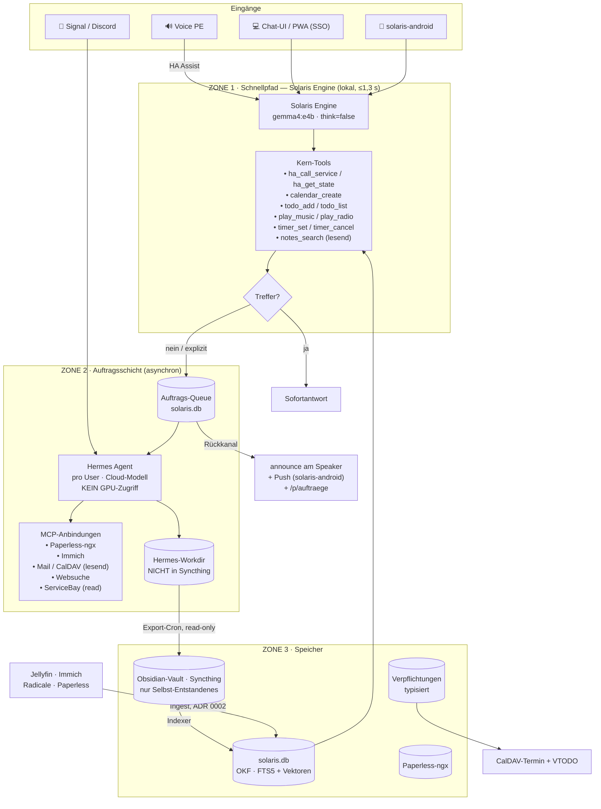
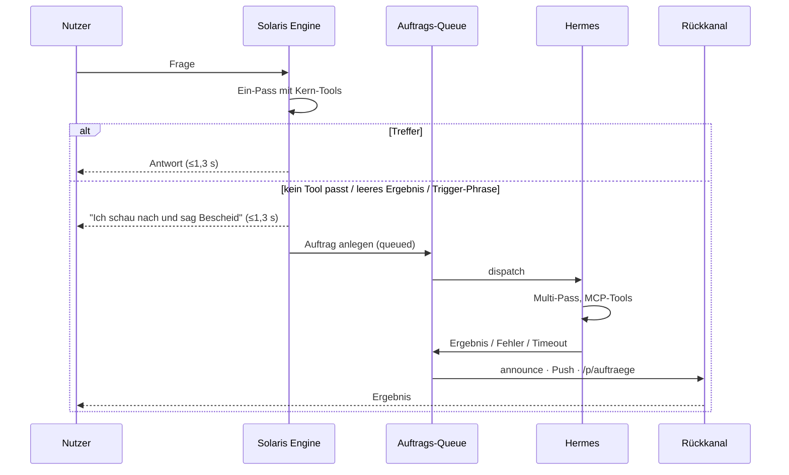
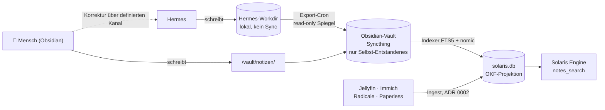
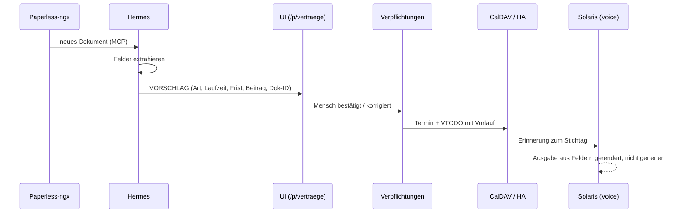
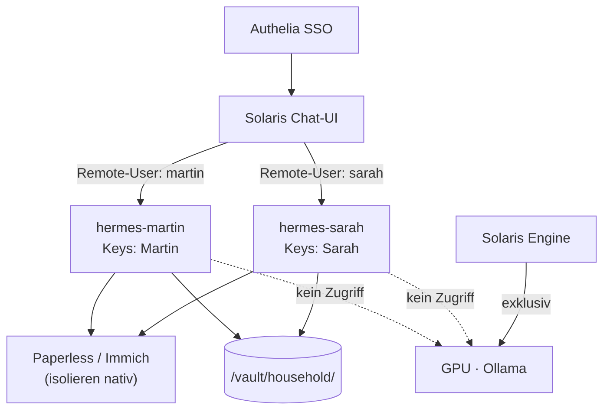
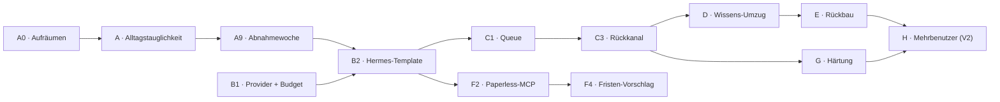

# Solaris · Zielarchitektur

**Status:** Entwurf zur Umsetzung
**Datum:** August 2026
**Systeme:** `solarisbay` · `solaris-android` · `servicebay` · Hermes Agent (Nous Research)
**Ersetzt:** „Architektur-Zielbild: Solaris Engine & Hermes Agent Transformation" (Juli 2026)

---

## 1. Zweck

Dieses Dokument beschreibt die Zielarchitektur des Haushaltssystems und legt fest, welche
Fähigkeiten selbst gebaut, welche zugekauft und welche gelöscht werden. Es ist die
Referenz für alle folgenden Entwicklungsschritte; Abweichungen davon gehören als neue
Entscheidung hier hinein und nicht in den Code.

**Zwei Nummernkreise, nicht verwechseln.** Die Entscheidungen dieses Dokuments heißen
**`ZA-01` … `ZA-18`** (Zielarchitektur). Die bestehenden, weiter gültigen ADRs des
Repos heißen **`ADR 0001` … `ADR 0011`** und liegen einzeln in
[`docs/adr/`](adr/README.md). Sie beschreiben unterschiedliche Ebenen: ADR = wie das
Substrat und die Oberfläche gebaut sind, ZA = wo welche Last läuft und wer sie sieht.
Wo beide dasselbe berühren, steht das Verhältnis in Abschnitt 11.1.

Die zentrale Leitfrage lautet nicht „Solaris oder Hermes", sondern: **Welche Anfrage hat
welches Zeitbudget, und wer darf sie sehen?**

---

## 2. Randbedingungen

| Randbedingung | Wert | Konsequenz |
| :--- | :--- | :--- |
| GPU | RTX 2000 Ada, 16,4 GB VRAM | Eine GPU serialisiert — jede zweite Last gefährdet die Sprachlatenz |
| Lokales Dialogmodell | `gemma4:e4b` (einziges) | Kein zweites Modell im Sprach- oder Chatpfad |
| Lokales Batchmodell | `gemma4:12b` (Vision) | Nur Crons/Dokumente, nie im Dialogpfad — siehe ZA-03 |
| Sprachlatenz | ≤ 1,3 s ab Sprachende | Harte Grenze, kein Verhandlungsspielraum |
| Restliche GPU-Last | Whisper · Kokoro-TTS · `nomic-embed-text` | Bleiben resident |
| Anwärter auf freien VRAM | Immich ML · Wakeword-Trainer (läuft bereits) | Freiraum ist verplant, nicht Reserve |
| Identität | LLDAP + Authelia | Vorhanden für UI-Kanäle, nicht für Sprache |
| Betrieb | ServiceBay auf Fedora CoreOS, Podman Quadlet | Alles Neue ist ein Template |
| Musik | Jellyfin (nicht Navidrome) | ServiceBay-Doku ist an dieser Stelle veraltet |
| Kalender & Listen | Radicale (CalDAV + VTODO) | Beides über eine Instanz, keine zweite Ablage |
| Dokumente | Paperless-ngx — **deployed und in Betrieb** (`paperless.dopp.cloud`) | Template liegt in `solarisbay/templates/paperless/`; Ingest-Adapter live (ADR 0008) |
| Nutzerzahl | V1 einbenutzerfähig, mehrere ab V2 | Trennung wird vorbereitet, nicht gebaut |
| Reifegrad | Testsystem. Im Alltag genutzt: HA-Steuerung über die Android-Widgets, Musik über Jellyfin + Symfonium. | Kein Rückbau-Risiko außerhalb dieser beiden Pfade |
| Datensouveränität | EU oder eigene Hardware. Keine US- und keine chinesischen Anbieter. | Bestimmt die Modellwahl (ZA-17, ZA-18) |

### Versionsbänder

| Band | Umfang |
| :--- | :--- |
| **V1** | Ein Nutzer. Schnellpfad-Ausbau, Hermes-Pilot, Auftragsschicht, Wissens-Umzug, Rückbau, Dokumente & Fristen, Härtung. |
| **V2** | Mehrbenutzer: Instanz pro Haushaltsmitglied, Authelia-Routing, Sprecher-ID als Kontext. |
| **V3** | Offen — was sich aus dem Betrieb ergibt. |

### Abnahmekriterium V1

V1 ist nicht über eine Featureliste definiert, sondern über tatsächliche Nutzung:

> **Eine Woche, in der Timer, Musik, Licht, Termine und Einkaufsliste ausschließlich
> über Solaris laufen.**

Das größte Risiko dieses Projekts ist nicht Datenverlust, sondern nie aus dem
Teststatus herauszukommen. Ein System, das niemand täglich benutzt, liefert kein Signal
darüber, was wirklich fehlt — und dann wird an Vermutungen entlang optimiert. Alles, was
für diese Woche nicht nötig ist, kommt danach.

Der Test hat einen unbequemen Teil: Musik läuft heute über Symfonium, nicht über
Sprache. Der Schnellpfad muss dagegen gewinnen, sonst ist `play_music` gebaut, aber
totes Gewicht.

---

## 3. Leitprinzipien

Diese fünf Sätze entscheiden im Zweifel jede Detailfrage.

1. **Zeitbudget bestimmt den Ort.** Alles unter 1,3 s läuft lokal in der Solaris Engine.
   Alles darüber ist ein Auftrag, kein Dialogturn.
2. **Die GPU gehört der Sprache.** Kein anderer Prozess belegt sie synchron. Seit
   #1332 gilt das ohne den alten Verdrängungspreis: llama-server hält **ein**
   Dialogmodell (e4b + MTP-Drafter, mit mmproj für Bilder) und daneben eine
   kleine Embedding-Instanz (~300 MB). Der Batch-Vision-Pfad (ZA-03) läuft am
   selben residenten Modell — kein Modellwechsel, kein Reload pro Sprachbefehl.
   Wer die ganze Karte braucht, nimmt sie über das Lease (#1319/#1325) und
   Solaris sagt für die Dauer ehrlich, dass es rechnet.

   > **Historie:** vor #1318/#1332 hielt `OLLAMA_MAX_LOADED_MODELS=2` `e4b` und
   > das Embedding-Modell resident; 12b verdrängte beim Laden `e4b`, und während
   > eines Dokumentenlaufs zahlte jeder Sprachbefehl den Reload (~6,8 s
   > box-gemessen). Ollama kannte keine Preemption.
3. **Harte Fakten werden nicht generiert, sondern eingesetzt.** Ein 4B-Modell wählt aus,
   es formuliert keine Zahlen und keine Daten.
4. **Ein Datum, ein Besitzer.** Jede Information hat genau ein System, das sie schreibt.
   Alle anderen lesen Projektionen.
5. **Was im Alltag genutzt wird, wird erst nach bewiesenem Ersatz abgeschaltet.**
   Was niemand nutzt, wird sofort gelöscht.

---

## 4. Gesamtbild

---

## 5. Zone 1 — Schnellpfad

Die Solaris Engine bleibt unverändert das, was sie ist: ein schlanker Ein-Pass-Loop mit
injizierter HA-Registry, `think=false`. Der Prompt lag am 2026-08-03 bei ~7,8k Token
— auf dieser Box gemessen, ein Haushalts-Turn gegen die Live-HA-Registry mit 34 Tools
und 51 injizierten Entitäten. Sie beantwortet alles, was eine feste Antwortform hat.

**Bestand — Dialog:** Haussteuerung mit Confirmation Gates · Musik & Radio über
Jellyfin · Timer/Wecker mit Speaker-Rückmeldung · lesende Vault-Suche · Chat-UI ·
Startseite, Energie, Notizen, Konzeptseiten · Android-Widgets.

**Bestand — Substrat und Oberflächen, die dieses Dokument nicht umbaut.** Sie sind
hier vollständig genannt, damit die Auslassung nicht als Rückbau-Ansage gelesen wird:

- **OKF-Substrat** — Entities, quellen-getaggte Fakten, Events, Konzepte, Vektoren in
  `solaris.db` (ADR 0002 bis ADR 0005). Es ist der Speicher, nicht der Vault.
- **Personen und Anbieter** — eine `person`-Entity je Mensch über alle Oberflächen
  (ADR 0010, Epic #999). Läuft unabhängig von diesem Dokument weiter.
- **Dokumente** — Paperless als Tresor, Solaris als Projektion (ADR 0008, Epic #934);
  das Dokumente-Portal ist lesend, Korrektur passiert in Paperless.
- **Import** — `Importer`-Protokoll mit Quellen als Plugins (ADR 0006): Google
  Takeout, YouTube-Music-Wunschliste, Posteingang. Der Standalone-Dienst
  `solaris-import-google` läuft noch und wird am Ende retired.
- **Composer-Oberflächen** — `/`-Control und `.tool` mit dem Erfassen-und-Finden-Muster
  (ADR 0009), Karten-SSOT und `.tool`-Plugins (ADR 0011).
- **CalDAV/CardDAV-Client** — `engine/ingest/dav_client.py`, `caldav.py`,
  `document_deadlines_sync.py`, `document_contacts_sync.py`. **Solaris hat bereits
  eine CalDAV-Implementierung**; das ist für ZA-09 und für A2/A4 wesentlich, siehe
  offener Punkt 4.

**Neu — Kalender und Listen, Weg noch offen.** Der Entwurf sah vor, Kalendereinträge
und Listen über die vorhandenen Home-Assistant-Dienste (`calendar.create_event`,
`todo.add_item`, `todo.get_items`) und damit über `ha_call_service` zu schreiben, mit
der Begründung „keine zweite CalDAV-Implementierung". Diese Begründung trägt nicht:
Solaris **hat** bereits einen CalDAV/CardDAV-Client, und der Weg über HA wäre der
zweite. Beide Wege sind vertretbar, aber sie sind gegeneinander abzuwägen statt
vorausgesetzt — **offener Punkt 4**. A2 und A4 sind bis zu dieser Entscheidung
funktional, nicht technisch spezifiziert. In beiden Fällen gilt: keine zweiten
Credentials, und der Zustand muss in jeder CalDAV-App auf dem Handy sichtbar sein.

**Was den Schnellpfad verlässt:** das Profil `solaris-deep` (nicht ein eigener Loop —
siehe ZA-04), eigene Websuche und Scraper, die Wissens-Crons (Stenograph,
Bibliothekar). Der **Timer- und Alarm-Scheduler bleibt** — er ist Kernfunktion, nicht
Wissensarbeit, und liefert zusätzlich den Rückkanal für Zone 2. Reihenfolge beachten:
der Stenograph läuft auf `solaris-deep` und die Dokument-Faktenextraktion auf dem
Bibliothekar-Client, beide müssen also vor ihrem jeweiligen Rückbau umziehen.

---

## 6. Zone 2 — Auftragsschicht

### 6.1 Eskalation ist deterministisch

Ein vorgeschalteter Klassifikator würde Latenz kosten und in beide Richtungen
falsch liegen. Stattdessen:

Zusätzlich zur automatischen Eskalation gibt es eine **explizite Auslösephrase**
(„schau mal genauer nach"), damit sie erzwingbar ist.

### 6.2 Die Auftrags-Queue

Tabelle in `solaris.db`:

`id · requester · kanal (voice|ui|android|signal) · anfrage · status · erstellt ·
gestartet · beendet · hermes_session_id · ergebnis_ref · kosten`

Status: `queued · running · done · failed · timeout`

Die `hermes_session_id` mitzuführen ist nicht optional — ohne sie ist ein
fehlgeschlagener Auftrag in Hermes' Session-Store nicht wiederauffindbar.

**Timeout mit Zustellung** ist Pflicht: Läuft ein Auftrag über die Grenze, wird der Turn
abgebrochen, der Status gesetzt und der Nutzer benachrichtigt. Stille Zombies sind sonst
gleichzeitig ein UX- und ein Kostenproblem.

### 6.3 Hermes-Betrieb

- **Eigenes Modell außerhalb der Voice-GPU.** Siehe ZA-02 und 6.4.
- **Ein Container pro Haushaltsmitglied** mit eigenen API-Keys für Paperless und Immich.
  Die Datentrennung übernehmen die Backends, nicht eigener Filtercode.
- **Toolsets eng geschnitten.** Der Prefill besteht überwiegend aus Tool-Schemas.
- **ServiceBay-MCP nur mit `read`-Token.** Die Scope-Leiter existiert bereits.
- **Messaging-Gateway aktiv** für Signal und Discord — der Teil, den selbst zu bauen
  sich am wenigsten lohnt.

### 6.4 Das Modell für Zone 2

Die Anforderung ist Souveränität, nicht Kosten (ZA-17): keine US-amerikanischen und
keine chinesischen Anbieter im Zielsystem. Damit bleibt **Mistral** als praktisch
einzige Modellfamilie — was kein Trostpreis ist.

| Modell | Größe | Lizenz | Speicher (Q4) | Rolle |
| :--- | :--- | :--- | :--- | :--- |
| Devstral Small 2 | 24B dense | Apache 2.0 | ~14 GB | Einstieg |
| **Mistral Small 4** | 119B MoE, ~6B aktiv | CC BY-NC 4.0 | **~65 GB** | **Zielmodell** |
| Devstral 2 | 123B | offen | ~70 GB | Spezialist lange Tool-Loops |
| Mistral Large 3 | 675B MoE, 41B aktiv | Apache 2.0 | ~340 GB | Obergrenze |

**Warum Mistral Small 4:** Es vereint Reasoning, Vision und agentisches Coding in einem
konfigurierbaren Modell. Entscheidend ist die MoE-Bauform — von 119 Milliarden
Parametern sind pro Token nur rund 6 Milliarden aktiv. Für einen Keller ist das ideal:
**Kapazität ist billig (RAM), Bandbreite ist teuer.** Ein Modell mit wenigen aktiven
Parametern läuft auch auf langsamem Unified Memory brauchbar, und asynchrone Aufträge
haben ohnehin kein Latenzbudget.

Lizenzhinweis: Small 4 ist nicht-kommerziell — für den Haushalt unproblematisch, für
eine Veröffentlichung nicht. Devstral Small 2 und Large 3 sind Apache 2.0.

#### Hardware-Stufen

| Ziel | Speicher | Hardware | Grob |
| :--- | :--- | :--- | :--- |
| Devstral Small 2 | 24 GB | gebrauchte 24-GB-Karte | 600–900 € |
| **Mistral Small 4** | **~65 GB** | **128-GB-Unified-Memory-Box** | **2.000–4.000 €** |
| Mistral Large 3 | ~340 GB | 512-GB-Unified oder EPYC mit viel RAM | 8.000–15.000 € |

Eine 128-GB-Box kostet weniger als eine einzelne 48-GB-Profikarte, liegt im Leerlauf bei
10–30 W statt 60–100 W und steht **physisch neben** dem Sprachserver statt darin — damit
gilt ZA-02 ohne Verrenkung.

#### Der Weg dorthin

**Erprobung:** Mistral-API (Paris, EU-Datenresidenz) oder ein EU-Hoster offener Gewichte
(IONOS, Scaleway, OVHcloud). Datenresidenz ist nicht Besitz, aber sie ist rechtlich real
und trägt, bis die eigene Hardware steht.

**Zielzustand:** eigene Box. Der Kaufzeitpunkt liegt bewusst **nach** den ersten Wochen
Auftragsbetrieb — dann ist bekannt, wie viele Aufträge pro Tag anfallen und wie groß sie
sind. Ob 65 GB reichen oder Large 3 nötig wird, ist dann eine Messung statt einer
Schätzung. Die Queue-Schnittstelle ist so zu bauen, dass der Wechsel eine
Konfigurationsänderung bleibt.

---

## 7. Zone 3 — Speicher und Besitzverhältnisse

Fünf Klassen, fünf Besitzer. Das ist die wichtigste Tabelle des Dokuments.

| Klasse | Beispiel | Besitzer (schreibt) | Leser | Eigenschaft |
| :--- | :--- | :--- | :--- | :--- |
| **Weiches Gedächtnis** | Präferenzen, „wen habe ich getroffen" | Hermes (Memory-Loop, Curator) | Solaris via Index | darf verblassen, Fehler billig |
| **Dokumente** | Rechnungen, Policen, Scans | Paperless-ngx | Hermes via MCP, Solaris via Projektion | OCR, Tags, Volltext |
| **Verpflichtungen** | Fristen, Beiträge, Laufzeiten | Mensch (bestätigt) | Solaris, Cron | typisiert, validiert, langlebig |
| **Notizen** | manuell Geschriebenes | Mensch (Obsidian) | alle | frei |
| **Extern Bezogenes** | Musik, Fotos, Kalender, Kontakte | das Fremdsystem (Jellyfin, Immich, Radicale, Paperless) | Solaris via OKF-Projektion | **kein** Markdown, neu-ingestierbar |

Die letzte Zeile ist nicht neu, sondern **ADR 0002**: Provenienz entscheidet über das
Substrat. Sie steht hier, weil ein früherer Entwurf dieses Dokuments den Vault als
*den* Speicher beschrieb. Das stimmt nur für selbst Entstandenes. Alles extern
Bezogene lebt ausschließlich als Projektion in `solaris.db` — genau deshalb ist der
Vault klein und nicht das Zentrum.

### Warum das Hermes-Workdir nicht im Syncthing-Ordner liegt

Der Hermes-Curator bewertet, konsolidiert und **löscht** seine Bibliothek autonom.
Syncthing löst Konflikte durch `sync-conflict`-Kopien. Ein autonom kürzender Prozess auf
einem eventually-consistent Ordner mit parallelen Handy-Edits produziert früher oder
später stillen Datenverlust — und der Indexer zieht die Konfliktkopien mit hinein.
Deshalb: Hermes arbeitet lokal, ein Cron spiegelt read-only in den Vault.
Menschliche Korrekturen laufen über einen definierten Kanal zurück, nicht durch
Direkt-Edit derselben Datei.

---

## 8. Querschnittsthemen

### 8.1 Identität und Sichtbarkeit

Sprechererkennung setzt den **Kontext** (eigene Favoriten, eigene Musik, eigene Timer).
Sie ist **keine Autorisierung**: Fernfeld-Erkennung ist unzuverlässig, und ein
aufgenommener Satz genügt als Angriff. Der Fehlerfall wäre ein Datenleck innerhalb der
Familie.

Daraus folgen drei Sichtbarkeitsklassen:

| Klasse | Beispiel | Sprache | SSO-Kanal |
| :--- | :--- | :--- | :--- |
| **Haushalt** | Heizung, Einkaufsliste, Familientermine | ✅ | ✅ |
| **Persönlich** | eigene Mails, eigene Fotos, eigene Termine | ✅ nur mit Sprecher-Treffer | ✅ |
| **Vertraulich** | Verträge, Versicherungen, Finanzen | ❌ nie | ✅ |

Am Speaker antwortet die vertrauliche Klasse mit einem Verweis, nicht mit Inhalt.

> **Ehrlicher Vorbehalt:** Der eigene Signal-Chat ist Direktzugang zu Hermes, an Solaris
> vorbei. Das ist gewollt — es war der Grund, Hermes überhaupt zu holen. Aber die
> Durchsetzung aus dieser Tabelle greift dort nicht; dort schützt allein die
> Container-Isolation aus Weg C. In V1 mit nur einer Instanz ist der Signal-Kanal damit
> faktisch unbeschränkt. Vertretbar, solange nur eine Person ihn nutzt — aber es darf
> niemanden überraschen.

### 8.5 Modelle und die Konfigurationsgrenze

**Die Modellauswahl ist keine Konfiguration mehr, sondern eine Eigenschaft der Zone.**

Zone 1 hat genau ein Dialogmodell: `gemma4:e4b`, `think=false`. Eine Auswahlmöglichkeit
wäre nur eine Möglichkeit, die Latenzgarantie zu verletzen. Der Wert steht in ZA-01 und
ZA-03, nicht in einer Einstellung. Das Batch-Vision-Modell (`gemma4:12b`, ZA-03) ist
davon unberührt — es ist ein Betriebsparameter des Ingest-Pfads, keine Dialogauswahl,
und taucht in keiner Nutzer-Einstellung auf.

> **Historie — die folgenden drei Absätze beschreiben den Ollama-Betrieb vor #1318/#1332.**
> Zone 1 läuft heute auf llama.cpp `llama-server` (Port 11435, ein residentes
> Dialogmodell + MTP-Drafter), nicht mehr auf Ollama mit mehreren residenten Modellen.
> §8.6 "Modell-Serving" beschreibt den aktuellen Stand.
>
> **Was der Batchpfad kostete, gemessen statt geschätzt.** `OLLAMA_MAX_LOADED_MODELS=2`
> (box-gemessen, `templates/ollama/variables.json`): `e4b` und `nomic-embed-text` waren
> resident, 12b passte nicht dazu und verdrängte beim Laden `e4b`. Ollama fuhr zwar je
> Modell einen eigenen Runner — deshalb lief ein Embedding-Request parallel zu einer
> Generierung —, aber der Deckel griff trotzdem. Folge während eines Dokumentenlaufs:
>
> - Ein Sprachbefehl, der in eine **laufende** 12b-Generierung fiel, wartete auf deren
>   Ende. Ollama konnte eine Generierung nicht unterbrechen.
> - Danach lud `e4b` neu: ~6,8 s. Der Lauf zahlte beim nächsten Dokument denselben Preis
>   in die Gegenrichtung.
> - Über einen längeren Lauf wechselten sich die beiden Modelle also im Verdrängen ab.
>
> **Der Batchpfad war damit nicht unterbrechbar, sondern nur planbar.** Das
> Wartungsfenster war eine Zeitspanne, in der niemand spricht.

Damit entfällt auch der Per-Turn-Schalter `think`:
sein Zweck war das Umschalten zwischen schnell und gründlich, und diese Entscheidung ist
jetzt die Eskalation — deterministisch nach ZA-10, nicht konfigurierbar.

Zone 2 wählt Hermes über seine eigene Provider- und Modellkonfiguration. Die wird
**nicht** in Solaris gespiegelt; zwei Wahrheiten über dasselbe sind schlimmer als eine
unbequeme.

Was von der bisherigen Konfiguration bleibt, sind Betriebsparameter, keine Modellnamen:
der llama-server-Endpunkt (vormals Ollama-Endpunkt), Kontextgröße und das
Embedding-Modell für den Indexer (noch auf Ollama, siehe §8.6).

#### Wer darf was einstellen

Die Trennlinie ist nicht Schwierigkeit, sondern **Blast Radius**.

| In `solaris-chat` (jeder Nutzer) | Nur ServiceBay / CLI (Betreiber) |
| :--- | :--- |
| Benachrichtigungs-Routing (Speaker, Push, Dringlichkeit) | Provider, Modell, Budget, Timeouts |
| Ansprache und Ton (Fortsetzung von `SOUL.md`) | Toolsets und MCP-Ziele |
| Sichtbarkeitsklassen des eigenen Kanals | Skills, Curator-Zyklus |
| Aufträge: ansehen, abbrechen, wiederholen | Messaging-Bridges einrichten |
| Erinnerungen ansehen und korrigieren | llama-server-/GPU-Lease-Betriebsparameter (vormals Ollama) |

Wer den Ton ändert, kann nichts kaputtmachen. Wer Toolsets ändert, verschiebt Prefill
und Kosten.

**Umfang in V1:** nur Benachrichtigungs-Routing und Korrekturkanal. Jede weitere
gespiegelte Einstellung ist ein Schema, das bei Hermes-Updates brechen kann. Der Rest
kommt erst, wenn die Abnahmewoche zeigt, dass er fehlt.

### 8.6 Modell-Serving

*Konzeptnachtrag, Operator-Auftrag „ollama ganz weg, auch foundry umstellen" (6.9.2026,
solarisbay#1345); gilt projektübergreifend auf dem atHome-Server.*

**Ein Modell-Server: llama.cpp `llama-server`** (ServiceBay-Template `llama`), im
Host-Netz, Port **11435**, OpenAI-kompatibel (`POST /v1/chat/completions`,
`/v1/embeddings` ab #1332, `/props`, `/slots`). Modelle sind GGUF-Dateien unter
`${DATA_DIR}/llama/models/` (Hugging Face `ggml-org`) — keine Registry, kein
`ollama pull`.

**Haushaltsmodell:** `gemma-4-e4b` (Q4_0) + MTP-Drafter + mmproj, Alias `gemma-4-e4b`.
Speculative Decoding halbiert die Antwortzeit (0,30 s statt 0,62 s je Antwort,
box-gemessen #1317/#1318) — das kann nur llama.cpp, nicht Ollama. Solaris' Engine
spricht diesen Server (`LLAMA_SERVER_URL`), Denken ist per
`chat_template_kwargs {enable_thinking:false}` aus — auch im Modus „Erweitert",
außer die Frage bittet ausdrücklich darum (Operator 13.9., siehe unten).

**Ein Server im Router-Modus, vier Presets, der Client wählt** (#1416, Operator
13.9.2026). llama-server hält alle Presets gleichzeitig auf **einem** Port und lädt
das an, nach dem das `model`-Feld der Anfrage fragt; das ungenutzte wird als LRU
verdrängt. Die GPU-Lease tauscht darum **keinen Server mehr aus**
(`${DATA_DIR}/solarisbay/gpu-lease.py`, Solaris-Internum): sie stellt die *Umgebung*
und schreibt `allowed` — die Presets, die im Modus erlaubt sind. Ohne `--model`
bleibt die Lease exklusiv: alles wird gestoppt, nichts antwortet.

**Zwei Modi, nicht vier** (#1435, Operator 19.9.2026). Was `foundry`, `thinking`
und `coding` unterschied, war ausschließlich die erlaubte Preset-Menge — die
Umgebung war bei allen dreien dieselbe. Drei Modi für einen Umgebungszustand
sind eine Unterscheidung ohne Unterschied, also beantwortet die Politik nur noch
die Frage, die sie beantworten muss: **darf die Karte gerade etwas anderes
bedienen als den Haushalt.** Welches Modell das dann ist, entscheidet, wer es
benutzt.

| Modus (Lease) | Preset, aus dem Solaris antwortet | erlaubte Presets | Sprachstack / Embeddings | Solaris-Chat |
| :--- | :--- | :--- | :--- | :--- |
| `haushalt` (keine Lease) | gemma-4 e4b + MTP + mmproj, 32k f16 | `gemma-4-e4b` | GPU / an | normal |
| `erweitert` | das gerade geladene Preset | **alle**, die der Router kennt | CPU / **aus** | antwortet weiter, denkt auf Zuruf |
| exklusiv (ohne `--model`) | — | — | gestoppt | stumm, ehrlicher Hinweis + Banner |

Die Preset-*Definitionen* bleiben unverändert — sie beschreiben Gewichte,
Kontextlänge und Drafter und werden weiter in `presets.ini` gebraucht. Und
`foundry`, `thinking` und `coding` bleiben als **Aliase** von `erweitert` auf
der Lease-API gültig (Vertrag foundry-chronicle#321), sie bestimmen nur noch,
welches Preset dem Halter als Antwortmodell genannt wird.

Der 26B-Plan ist gestrichen (#1325: passt nicht neben den Sprachstack).

**Denken kommt auf Zuruf** (Operator 13.9.): auch in „Erweitert" antwortet
Solaris normal; der Reasoning-Trace wird nur eingeschaltet, wenn die Frage darum
bittet („denk mal nach", „überleg", „gründlich", „Schritt für Schritt",
„rechne", „Logik" — dieselbe Phrasenliste, die auch `reasoning_effort` hebt).
Sonst kostete „mach das Licht aus" im Denkfenster sechs von sieben Token für
einen Text, den niemand sieht.

**Der Embedding-Server pausiert in „Erweitert"** (Operator 19.9., gemessen in
#1434). MoE und `llama-embed` passen zusammen nicht auf die Karte: 15 620 von
16 380 MiB lassen 760 übrig, und der Compute-Buffer des Drafters lief um 168 MiB
über. Die semantische Vault-Suche fällt für das Fenster auf Stichwortsuche
zurück — mit zwei Modi ist das Teil der Entscheidung statt ein gebrochenes
Versprechen. Zusätzlich stoppen `solaris-whisper-batch` und
`solaris-wakeword-trainer`; der Sprachstack wechselt auf die CPU.

**Denken ist kein Preset, sondern ein Schalter je Anfrage.** `--reasoning off` gibt es
nicht mehr: ein Router serviert vier Modelle, ein serverweiter Schalter würde für alle
entscheiden. Solaris' Engine schickt `chat_template_kwargs {enable_thinking:true}` im
Modus `erweitert`, wenn die Frage darum bittet, und sonst `false`; fremde Clients
(aider, goose, Continue, pi-web) setzen ihn selbst.

**Ein Policy-Proxy setzt die Modus-Politik durch** (#1416). Der Router kennt keine
Politik — er lädt, wonach gefragt wird — also bindet er nur noch `127.0.0.1:11434`,
und `solaris-llama-policy.service` hält `11435` davor. Der Proxy liest bei *jeder*
Anfrage das `allowed` aus der Lease-Datei: ein Preset außerhalb bekommt `409` mit
Modus und erlaubter Liste, `GET /v1/models` nennt **alle** Presets und markiert je
Eintrag mit `allowed_in_mode`, welche der stehende Modus zulässt (#1431), alles
andere geht unverändert durch — Streams Stück für Stück. Damit gilt die Politik auch
für Clients, die nie durch die Engine laufen (pi-web, aider, goose, Continue); die
Engine prüft zusätzlich auf ihrer Seite, und die HTTP-Lease-Schicht lehnt ein fremdes
Fenster weiterhin mit `409` samt Modus und `allowed` ab.

**Nachbardienste holen sich das Modell über HTTP, nie über das Skript:**
`POST/GET/DELETE http://127.0.0.1:8787/api/model-lease` (loopback, kein Token;
Vertrag foundry-chronicle#321). `POST {"model":"foundry","ttl_s":900}` → `200 ready`
mit `alias` oder `202 preparing` mit `retry_after` (dann `GET` pollen), `409 held`
bei fremdem Halter; `DELETE` gibt frei; ohne `DELETE` läuft die Frist ab und das
Haushaltsmodell kommt zurück. Optionales `holder` (#1347) benennt den *Dienst*
(ein dauerhafter Name wie `foundry-chronicle`, keine Sitzung, Runde oder Gruppe):
`GET` liefert den Halter, `DELETE {"holder": ...}` gibt nur dessen Fenster frei,
`DELETE` ohne Body bleibt der Operator-Notausgang. Das `model`-Feld jeder `/v1`-Antwort trägt den Alias
des tatsächlich geladenen Modells — **Herkunft aus der Antwort, nie aus der
Einstellung.**

**Erreichbarkeit für Nachbar-Pods** (Nachtrag 6.9., solarisbay#1344): llama-server
bindet auf `0.0.0.0`, nicht nur Loopback, damit isolierte Pods ohne Host-Netz
(z. B. claude-dev) es über `host.containers.internal` erreichen. Regel für
Verbraucher: Host-Netz-Dienste → `127.0.0.1:11435`, isolierte Pods →
`host.containers.internal:11435`.

**Nachtrag 13.9. (solarisbay#1420): die LAN-Seite ist offen, als Entscheidung.**
`blockLanAccess` steht für `LLAMA_PORT` auf `false`, ServiceBay nimmt den Port
also nicht in seine Sperrmenge auf; jedes Gerät im Heimnetz erreicht den
Endpunkt über die Box-IP. llama-server bringt keine Anmeldung mit, der
Policy-Proxy auch nicht — Modelle auflisten, Anfragen stellen, GPU-Zeit
verbrauchen ist damit für das ganze WLAN möglich. Der Betreiber will das genau
so; die Modus-Politik bleibt wirksam und es gibt weiterhin keine Proxy-Route,
also nichts davon aus dem Internet. Zurückdrehen ist eine Entscheidung mit dem
Betreiber, keine Aufräumarbeit.

**Ollama wird abgeschaltet** (solarisbay#1332): Embeddings (`nomic-embed-text`) und
Vision-Ingest wandern auf llama.cpp; das `ollama`-Template wird stillgelegt (Tombstone,
nicht gelöscht — siehe `CLAUDE.md` "Retiring a delivered artifact"); der Dienst auf der
Box wird deinstalliert, sobald foundry seinen echten `/v1`-Aufruf bestätigt hat. Bis
dahin läuft Ollama nur noch als Übergang auf 11434 für Embeddings/Vision — **nichts
Neues darf mehr dagegen gebaut werden.**

Die HA-Conversation-Integration spricht weiterhin die Ollama-**kompatible** Facade der
Engine (`/ollama/api/chat` auf 8787) — das ist ein Protokoll, kein Dienst, und bleibt
auch nach der Ollama-Abschaltung bestehen (siehe `voice-gatekeeper/README.md`).

### 8.2 Benachrichtigung

Der ausgehende Kanal existiert bereits über `solaris-android`. Routing:

| Dringlichkeit | Zustellung |
| :--- | :--- |
| Beiläufig | `/p/auftraege`, kein Push |
| Normal | Speaker bei Anwesenheit, sonst Push |
| Wichtig (Fristen) | Push **und** Speaker |
| Push fehlgeschlagen | Signal als Fallback |

### 8.3 Degradation ohne Internet

Der lokale Kern läuft weiter: Wake Word, Haussteuerung, Timer, Musik, Vault-Suche, TTS.
Die Eskalation prüft Konnektivität **vor** Auftragsannahme und antwortet sofort
(„Nachschlagen geht gerade nicht, ich hole es nach"); der Auftrag bleibt `queued` und
wird bei Rückkehr abgearbeitet. Kein Timeout-Warten am Lautsprecher.

Zu prüfende stille Abhängigkeiten: Authelia, DNS über AdGuard, NTP-Drift,
Zertifikatserneuerung bei längeren Ausfällen.

### 8.4 Kosten

Sichtbarkeit liefert Hermes selbst (`/usage`, `/insights`), vertieft durch `agenttrace`
(Kosten-Spitzen, Tool-Fehler, Retry-Loops). Der **harte Deckel gehört zum Provider**
(Budget-Limit auf dem API-Key) — ein Prozess, der seine eigenen Kosten begrenzen soll,
versagt genau dann, wenn er kaputt ist. Zweiter Gürtel: Zeitlimit pro Auftrag.

---

## 9. Praxisfall: Vertrag mit Frist

Extraktion ist immer ein Vorschlag. Eine Kündigungsfrist ist entweder korrekt oder sie
kostet eine automatische Verlängerung — das ist kein Fall für die weiche Ebene.

---

## 10. Multi-User (V2)

Hermes ist ein schlanker Python-Prozess; mehrere Instanzen kosten kaum Speicher. Der
entscheidende Zusatz gegenüber dem Vorentwurf: **keine Instanz fasst die GPU an.**

**Was V1 dafür schuldet:** Das Hermes-Template bekommt von Anfang an einen
Profil-Parameter (Name, Key-Set, Workdir-Pfad, Vault-Unterordner) — auch wenn es nur
einmal instanziiert wird. Ebenso führen Queue und Rückkanal von Beginn an einen
`requester` mit. Beides kostet in V1 fast nichts; nachträglich eingezogen ist es ein
Schema-Umbau mit Datenmigration. Siehe G-9.

---

## 11. Architekturentscheidungen (ZA)

| ID | Entscheidung | Begründung |
| :--- | :--- | :--- |
| **ZA-01** | Die Solaris Engine behält das Ollama-Facade für HA Assist. | Garantiert ≤1,3 s am Voice PE. |
| **ZA-02** | **Hermes erhält keinen Zugriff auf die Voice-GPU** und läuft auf getrennter Rechenkapazität — EU-gehostet in der Erprobung, eigene Hardware im Zielzustand. | Eine GPU serialisiert. Ein Hermes-Turn würde jeden Sprachbefehl dahinter einreihen — genau die 3–6 s, wegen derer Hermes im Juni entfernt wurde, nur diesmal sporadisch und damit schlimmer. |
| **ZA-03** | **`gemma4:e4b` ist das einzige Modell im Dialogpfad** — Sprache und Chat. `gemma4:12b` verlässt den Dialogpfad, **bleibt aber als Batch-Vision-Modell** für die Dokumenten-Extraktion. Es wird bedarfsweise geladen, nie resident gehalten und läuft ausschließlich in Crons/Ingest, nie in einem Turn. | 16,4 GB VRAM; freier Speicher ist für Immich-ML und Wakeword-Training verplant. Folge: der Chat-Modus „Solaris Gründlich" wird durch die Auftragsschicht ersetzt. Der Vision-Pfad bleibt, weil Paperless' eigenes Tesseract gedrehte deutsche Scans zu Müll macht (auf der Box belegt, PoC #929) — ohne 12b hätte Spalte F keine Textquelle. |
| **ZA-04** | Das `solaris-deep`-**Profil**, Websuche und Scraper werden gelöscht. | Redundanz zu Hermes. **Korrektur der ursprünglichen Begründung:** `solaris-deep` ist kein eigener Agenten-Loop und kein 6-Pass-Loop. Es ist ein Profil mit derselben Toolbox, derselben Registry und demselben Modell wie `household` — nur `think_default=True` (`engine/profiles.py`). Die sechs Pässe (`_MAX_PASSES = 6` in `client.py`) sind das Tool-Call-Budget des **einen** gemeinsamen Loops und gelten für jedes Profil, auch für den Schnellpfad. Es entfallen also keine tausenden Zeilen Agentencode, sondern ein Profil und der Modus Gründlich. **Vorsicht:** die Nacht-Crons laufen auf diesem Profil — siehe A01. |
| **ZA-05** | Weiches Gedächtnis zieht zu Hermes (Memory-Loop + Curator). Stenograph und Bibliothekar werden abgeschaltet — **unter der Bedingung, dass Export und Indexer die Quellenangabe je Fakt durchreichen** (ADR 0003). Ohne erfüllte Bedingung wird nicht abgeschaltet. | Gepflegtes Ökosystem statt Eigenbau; identisches Problem, fremde Wartung. Die Bedingung steht, weil ADR 0003 den Stenograph als Quelle quellen-getaggter Fakten führt (`used_to_love`, `source = stenograph`); ginge die Provenienz beim Umzug verloren, verlöre ZA-05 etwas Reales statt nur etwas Selbstgebautes. |
| **ZA-06** | **Hermes' Arbeitsverzeichnis liegt außerhalb des Syncthing-Vaults; ein Export-Cron spiegelt read-only.** | Autonomes Pruning + eventual consistency + parallele Handy-Edits = stiller Datenverlust. |
| **ZA-07** | Verpflichtungen sind eine **typisierte Tabelle** mit menschlicher Bestätigung, **projiziert als OKF-Entity** damit Chat und Suche sie finden; Ausspielung über CalDAV/VTODO. | Fristen sind Domänenlogik, keine Agentenaufgabe. Die Sondertabelle ist geprüft und begründet: das OKF-Faktenmodell kennt **keine** typisierten Pflichtattribute und **keine** Validierung — `facts(predicate, value, confidence)` speichert jeden Wert als Text, `writer.py` validiert nichts außer dem Pfad, und die Pflichtangaben in `docs/okf-write-contract.md` §3 sind Konvention, nicht Zwang. Für eine Kündigungsfrist, die entweder stimmt oder eine automatische Verlängerung kostet, reicht das nicht. Die Projektion nach OKF hält gleichzeitig ADR 0003 ein: **eine** Entity je Vertrag, die Tabelle ist die Wahrheit, die Entity die auffindbare Sicht. |
| **ZA-08** | Paperless-ngx ist der Dokumententresor. Kein Eigenbau für OCR, Tagging, Ablage. | Fertig, ausgereift, ServiceBay-Template. **Deckungsgleich mit ADR 0008**, dort bereits umgesetzt — ZA-08 bestätigt, es entscheidet nichts Neues. |
| **ZA-09** | **HA ist der Weg zu Geräten. Für Datenspeicher, mit denen Solaris ohnehin spricht, ist der eigene Client der Weg.** Neue Drittsystem-Konnektoren entstehen weiterhin nicht; neue Drittsysteme hängen als MCP an Hermes. Kalender und Listen werden folglich direkt über `dav_client` geschrieben, nicht über `ha_call_service`. | Eine Implementierung pro Fremdsystem. Solaris schreibt über `document_deadlines_sync.py` bereits direkt CalDAV — der HA-Weg wäre die zweite Abstraktion auf denselben Radicale-Server. Dazu drei Betriebsgründe: HA-Neustarts sind häufig und würden eine Kernfunktion des Schnellpfads mitreißen; `calendar.create_event` kennt weder VALARM noch nennenswerte Recurrence, die ZA-07 für Fristen-Vorläufe braucht; und es ist ein Hop weniger im Latenzbudget. |
| **ZA-10** | Eskalation ist deterministisch (Fast-Loop zuerst, Fehlschlag eskaliert) plus explizite Phrase. | Ein Vorab-Klassifikator kostet Latenz und irrt beidseitig. |
| **ZA-11** | Ergebnisse aus Zone 2 kommen asynchron über `announce` und Push zurück, nie als blockierender Call. | Ein Hermes-Turn ist zweistellig in Sekunden; am Speaker wäre das Stille. |
| **ZA-12** | Sprechererkennung ist Kontext, nicht Autorisierung. Vertrauliches nie über Sprache. | Fernfeld-Erkennung ist täuschbar; Fehlerfall ist ein Datenleck in der Familie. |
| **ZA-13** | Der harte Kostendeckel liegt beim Provider, nicht im Agenten. | Selbstbegrenzung versagt im Fehlerfall. |
| **ZA-14** | `solaris-chat` bleibt die einzige Haushaltsoberfläche. | Eine PWA, ein SSO, ein Ort. |
| **ZA-15** | **Die Modellwahl ist Zonen-Eigenschaft, keine Konfiguration.** Zone 1 hat genau ein Modell ohne Auswahl; der Per-Turn-Schalter `think` entfällt. Hermes' Modellkonfiguration wird nicht in Solaris gespiegelt. | Eine Auswahl in Zone 1 wäre nur ein Weg, die Latenzgarantie zu brechen. Zwei Wahrheiten über dieselbe Einstellung sind schlimmer als eine unbequeme. |
| **ZA-16** | **Konfiguration wird nach Blast Radius aufgeteilt.** Verhalten (Benachrichtigung, Ton, Sichtbarkeit, Aufträge, Erinnerungen) in `solaris-chat`; Betrieb (Provider, Budget, Toolsets, MCP, Skills, Bridges) nur über ServiceBay/CLI. | Kein Haushaltsmitglied braucht die Hermes-CLI, um seinen Assistenten zu benutzen (ZA-14). Umgekehrt darf niemand versehentlich Prefill und Kosten verschieben. |
| **ZA-17** | **Datensouveränität: EU oder eigene Hardware.** Keine US-amerikanischen und keine chinesischen Anbieter im Zielsystem — weder für Inferenz noch für Speicher. | Die rechtliche Lage außerhalb der EU ist zu fragil; Rechte an den eigenen Daten werden dort bereits heute unzureichend geschützt. Das ist keine Kostenfrage und wird nicht gegen Kosten abgewogen. |
| **ZA-18** | **Zone 2 fährt Mistral.** Zielmodell `Mistral Small 4` (119B MoE, ~6B aktiv) auf einer eigenen 128-GB-Unified-Memory-Box; EU-gehostete API während der Erprobung. Kaufzeitpunkt nach Messung des Auftragsvolumens. | Aus ZA-17 folgt Mistral als praktisch einzige Familie. Die MoE-Bauform passt zum Keller: Kapazität ist billig, Bandbreite teuer, und asynchrone Aufträge haben kein Latenzbudget. |

---

### 11.1 Verhältnis zu den bestehenden ADRs

Die ADRs in [`docs/adr/`](adr/README.md) bleiben in Kraft. Sie beschreiben eine andere
Ebene als dieses Dokument: **ADR = wie das Substrat und die Oberfläche gebaut sind,
ZA = wo welche Last läuft und wer sie sehen darf.** Wo beide dieselbe Sache berühren,
gilt Folgendes.

**Deckungsgleich — hier entscheidet ZA nichts Neues:**

| ADR | ZA | Verhältnis |
| :--- | :--- | :--- |
| ADR 0008 · Dokumente in Paperless | ZA-08 | identisch, ADR ist die ältere und detailliertere Fassung |
| ADR 0007 · keine neue Oberfläche | ZA-14 | identisch, eine PWA, ein SSO |
| ADR 0002 · Provenienz entscheidet das Substrat | Abschnitt 7 | ZA übernimmt ADR 0002, es ersetzt es nicht |

**Nachgeführt — ZA hat sich der Realität angepasst, nicht umgekehrt:**

- **ZA-03 vs. ADR 0008.** Der erste Entwurf strich `gemma4:12b` ersatzlos. Der
  12b-Vision-Extraktor ist aber die Textquelle für Paperless (Rescope in #934, PoC
  #929): Paperless' eigenes Tesseract garbled gedrehte deutsche Scans. ZA-03 trennt
  daher Dialog- und Batchpfad, statt das Modell zu löschen. ADR 0008 sagte das
  Gegenteil („retire the in-Solaris extractor") und war damit veraltet — nachgezogen
  in **[ADR 0012](adr/0012-paperless-stores-solaris-extracts.md)**, das diese Klausel
  ablöst.
- **ZA-09 vs. ADR 0006.** ADR 0006 lässt Import-Plugins direkt nach Radicale schreiben
  (CalDAV/CardDAV PUT). Das ist ein bestehender Konnektor und bleibt. ZA-09 verbietet
  nur **neue**.

**Aufgelöste Konflikte — alle vier entschieden, keiner mehr offen:**

| Konflikt | Betrifft | Worum es geht |
| :--- | :--- | :--- |
| **ZA-05 vs. ADR 0003** | Spalte D/E | **Konditioniert statt entschieden.** ADR 0003 bleibt unangetastet; ZA-05 und D3 tragen jetzt die Vorbedingung, dass Export und Indexer die Quellenangabe je Fakt durchreichen. Ist sie nicht erfüllt, wird der Stenograph nicht abgeschaltet. |
| **C4 vs. ADR 0007** | Spalte C | **ADR 0007 gewinnt.** C4 heißt jetzt „eine Auftrags-Ansicht" ohne festgelegte Platzierung; keine sechste Rail-Position. Panel im Chat oder die Stelle, an der „Gründlich" verschwindet — entschieden wird beim Bauen, nicht hier. |
| **ZA-15 vs. ADR 0009** | Spalte E | **ZA-15 gewinnt.** `/thinking` fällt mit dem `think`-Schalter. ADR 0009 wird nicht editiert — **[ADR 0013](adr/0013-thinking-command-retired.md)** löst seine Kommandoliste ab. |
| ~~Verpflichtungen vs. ADR 0003~~ | Spalte F | **Geprüft und entschieden.** Das Entity-Modell kann keine typisierten Pflichtattribute und keine Validierung (Belege in ZA-07). ZA-07 bleibt daher als Tabelle, bekommt aber eine OKF-Projektion, damit ADR 0003 gewahrt bleibt: eine Entity je Vertrag, kein zweiter Personen-/Anbieter-Namensraum. |

Kein bestehendes ADR wurde dafür editiert. Wo ein ADR überholt war, löst ein neues es
ab (ADR 0012, ADR 0013) — die Append-only-Regel aus `docs/adr/README.md` gilt auch für
Abweichungen, die aus diesem Dokument kommen.

---

## 12. Entwicklungs-Guidelines

**G-1 · Zahlen und Daten werden nicht generiert.**
Retrieval liefert strukturierte Records; die Ausgabe rendert ein Formatter aus Feldern.
Zusätzlich ein Nachprüfer: Jede Zahl und jedes Datum in der Antwort muss im
Retrieval-Kontext vorkommen — sonst wird verworfen und der Record wörtlich vorgelesen.
Kostet keine Latenz und fängt den gefährlichsten Fehlermodus eines 4B-Modells.

**G-2 · Kein neues Tool im Schnellpfad ohne Latenzmessung.**
Jedes Tool vergrößert das Schema und damit den Prefill. Aufnahme nur mit gemessener
p95-Latenz vor und nach der Änderung.

**G-3 · Jede Fähigkeit hat genau einen Besitzer.**
Vor jedem neuen Feature: Welche Speicherklasse (Abschnitt 7)? Wer schreibt? Wenn die
Antwort „beide" lautet, ist der Entwurf falsch.

**G-4 · Rückbau nach Nutzung, nicht nach Kalender.**
Code auf einem täglich genutzten Pfad (HA-Steuerung, Musik, Timer) wird deaktiviert,
beobachtet, dann gelöscht. Code, den niemand benutzt, wird sofort gelöscht — ihn
„sicherheitshalber" mitzuschleppen kostet Pflege und macht jede Antwort mehrdeutig,
weil unklar bleibt, welcher Loop sie erzeugt hat.

**G-5 · Alles Neue ist ein ServiceBay-Template.**
Kein handgepflegter Container, keine Sonderinstallation.

**G-6 · Sichtbarkeitsklasse ist Pflichtangabe.**
Jedes Tool, das Daten liest, deklariert Haushalt / Persönlich / Vertraulich. Ohne
Angabe gilt Vertraulich.

**G-7 · Jeder externe Aufruf hat ein Zeitlimit und einen sichtbaren Zustand.**
Kein Fire-and-forget ohne Queue-Eintrag.

**G-8 · Der lokale Kern bleibt ohne Internet funktionsfähig.**
Neue Schnellpfad-Funktionen dürfen keine Cloud-Abhängigkeit einführen.

**G-9 · Mehrbenutzerfähigkeit wird in V1 nicht gebaut, aber nie verbaut.**
Jede neue Tabelle führt einen `requester`, jeder Pfad ist parametrisiert, kein Nutzer
ist hart verdrahtet. Kein Filtercode, keine zweite Instanz — nur keine Sackgasse.

---

## 13. Offene Punkte

Diese Fragen blockieren einzelne Backlog-Positionen und sollten vor Phase 2
beantwortet sein — siehe die Rückfragen im Begleittext.

1. **Mistral-Zugang für die Erprobung:** eigene API (Paris) oder EU-Hoster offener
   Gewichte (IONOS, Scaleway, OVHcloud)? Plus Budgetgrenze. Blockiert B2. Bewusst
   offen bis nach der Abnahmewoche.

Das war es. Die beiden früheren Punkte zur Sprechererkennung und zum Stenograph sind
beantwortet und stehen in 13.1 und 13.2 — beide Mechanismen standen bisher nirgends
zusammenhängend beschrieben.

### 13.1 Sprechererkennung — ein Weg, nicht zwei

Die frühere Vermutung war, PE-Pfad und Gatekeeper seien zwei getrennte Wege. Sind sie
nicht: **die Erkennung liegt ausschließlich im `voice-gatekeeper`, der PE-Pfad liest
ihr Ergebnis.**

- **Erkennung.** `voice-gatekeeper/src/gatekeeper/speaker.py` — ECAPA-TDNN über
  SpeechBrain, 192-dimensionale Embeddings, k-NN gegen `voice_embeddings` in
  `solaris.db`. Der Resolver selbst ist reines numpy und ML-frei; nur der Extraktor
  braucht SpeechBrain.
- **Aktivierung.** Zwei Bedingungen: das ML-Image (`solaris-gatekeeper-ml`, das
  SpeechBrain/torch mitbringt) und `SOLARIS_SPEAKER_ID_ENABLED`. **Beide sind auf der
  Box erfüllt** — das Pod-Spec fährt das ML-Image mit `SPEAKER_ID_ENABLED=true`,
  Schwelle 0,55, Kollisionsschwelle 0,65, Match-Marge 0,10.
- **Die Brücke zum PE-Pfad.** Ist Sprecher-ID an, registriert `post-deploy.py` den
  Gatekeeper als **Wyoming-STT-Entity** und die Assist-Pipeline nimmt ihn statt des
  nackten Whisper (`ensure_assist_pipeline(prefer_gatekeeper_stt=…)`). Der Gatekeeper
  transkribiert intern über denselben Whisper — die STT-Ausgabe ist identisch —,
  löst zusätzlich den Sprecher auf und legt `{Transkript, Raum → uid, matched}` in
  `solaris.db` ab. Die Engine-Facade liest diesen Stash auf dem Rohtranskript wieder
  aus (`voice_uid_stash.consume_speaker`).
- **Der Schlüssel ist Transkript + Raum** (#1218). Auf dem Satelliten-Pfad kennen beide
  Seiten den Raum — der Gatekeeper schickt ihn als `[room: X]`-Präfix, die Facade liest
  ihn dort wieder heraus —, also sind zwei Räume zwei Zeilen. Wo nur eine Seite ihn
  kennt (HA-STT-Pfad: der Peer des Gatekeepers ist HA, nicht der Satellit), bleibt das
  Transkript allein der Schlüssel, und eine Kollision **schließt zu**: eine lebende
  Zeile mit fremder uid wird auf `guest`/`matched=0` herabgestuft, ein mehrdeutiger
  Treffer wird verworfen. Keiner der beiden Sprecher bekommt die Identität des anderen.
- **Zwei getrennte Aussagen pro Zeile.** `uid` ist das *Routing* (wem gehört der Turn),
  `matched` ist die *Erkennungsaussage* des Gatekeepers. Nur `matched=1` schaltet die
  Klasse *Persönlich* frei — nicht die Existenz der Zeile und nicht der uid-Wert
  (#1152).
- **Fehlerfälle.** Erkannt, aber keinem Bewohner zuzuordnen → Gast-uid mit
  `matched=0` → Gast-Profil (eingeschränkte Tools, ephemer, schreibt nichts).
  Stash-Miss, weil Sprecher-ID aus ist oder nicht lief → `DEFAULT_UID`. Der
  Unterschied ist gewollt: *unbekannt erkannt* ist etwas anderes als *nicht erkannt*.

Für ZA-12 heißt das: Sprecher-ID ist **im Betrieb, nicht in Planung**. Der Satz
*Kontext, nicht Autorisierung* beschreibt damit einen laufenden Mechanismus, und A7
setzt auf etwas Reales auf. Für V2 (H4) ist keine zweite Erkennung zu bauen — nur
Routing auf das vorhandene Ergebnis.

### 13.2 Stenograph — was er ist und wohin er schreibt

Ein nächtlicher Cron (`engine/crons.py::_stenograph`). Er liest je aktiver Session die
Turns seit dem letzten Wasserzeichen und destilliert sie. Er schreibt **in beide
Substrate**, nach klarer Regel:

| Was | Wohin | Wie |
| :--- | :--- | :--- |
| Musik-Affinität (*war früher mein Lieblingsalbum*) | **nur Projektion** in `solaris.db` | deterministischer Pfad, kein LLM: `used_to_love`-Fakt am Album, `source=stenograph`, `projection_only=True` |
| Die Erinnerung dazu, wenn sie Erzählung enthält | **Vault-Markdown** | Musik-Erinnerungs-Notiz, mit dem Album verlinkt — selbst entstanden, also Markdown nach ADR 0002 |
| Allgemeine dauerhafte Fakten | **Vault-Markdown** | über das `fact_store`-Tool in einem LLM-Turn: `facts/` bzw. `users/<uid>/facts/` als Tagesdatei |

**Damit ist ZA-06 kein reiner Vorsorgepunkt — aber auch kein akutes Risiko.** Der
Stenograph schreibt heute in den Syncthing-Vault, allerdings nur *anlegend*, nie
kürzend. Das Risiko aus ZA-06 ist autonomes **Löschen** auf einem
eventually-consistent Ordner; das tut der Stenograph nicht, der Hermes-Curator soll es
tun. ZA-06 bleibt also richtig und bleibt Vorsorge — die Begründung *bei uns schreibt
niemand in den Vault* wäre aber falsch.

**Und er hängt an `solaris-deep`.** Die LLM-Hälfte läuft über den `deep`-Client
(`crons.py`: *The Stenograph runs LIVE deep-client turns*). A01 entfernt genau dieses
Profil — siehe die Korrektur an ZA-04.

Er ist dabei nicht der einzige. **Vier Dinge hängen an diesem Anschluss**, drei davon
unsichtbar: der Stenograph, die skill-gesteuerten Cron-Jobs (`daily-chronicle`,
`problem-summarizer`, `chat-compactor`), die nächtliche Kompaktierung alter Sessions —
und der Chat-Modus *Gründlich* als einziges sichtbares Element. Ersatzloses Löschen
legt die ersten drei **still** still: kein Fehler, kein Log, sie laufen nur nie wieder
durch. Nicht betroffen ist die Kompaktierung im laufenden Turn (`server.py`), die den
Client des aufrufenden Profils bekommt.

**Entschieden (2026-08-03): umziehen.** Die vier Nutzer wechseln auf `household`. Das
kostet nichts, weil das Denken nicht am Profil hängt: `client.py` setzt
`think = think_default or reasoning_effort not in ("", "none")`, und jeder Nacht-Job
übergibt ohnehin `"high"`. Gleiches Modell, gleiche Toolbox — ein Wortwechsel an vier
Stellen. *Gründlich* verschwindet ersatzlos aus der Oberfläche; die Lücke bis zur
Auftragsschicht (Spalte C) wird bewusst in Kauf genommen, weil der Modus heute
dasselbe Modell fährt wie der normale Chat.
### Geklärt

- Radicale kann Kalender und Todo — beides läuft über eine Instanz, sie läuft
  (`caldav.dopp.cloud`).
- Musik ist Jellyfin; die ServiceBay-Doku (Navidrome) ist veraltet.
- **Paperless-ngx ist deployed und in Betrieb**, das Template liegt in
  `solarisbay/templates/paperless/`, SSO über Authelia und der Ingest-Adapter laufen
  (#929–#931, #1042–#1052 alle geschlossen). F1 schrumpft entsprechend.
- Der Vault ist **nicht** das Substrat — extern Bezogenes lebt als OKF-Projektion
  (ADR 0002). Siehe Abschnitt 7.
- Mehrbenutzer ist V2. V1 bereitet nur vor (G-9).
- Modellfamilie und Hardware-Ziel stehen fest (ZA-17, ZA-18).
- `gemma4:12b` bleibt als Batch-Vision-Modell erhalten (ZA-03).
- **Kalender und Listen werden direkt über `dav_client` geschrieben**, nicht über
  `ha_call_service` (ZA-09). Damit ist A1 kein Vorläufer mehr, sondern optional.
  Praxishinweis für den Fall, dass HA-Dashboards die Termine trotzdem zeigen sollen:
  HAs CalDAV-Integration pollt, direkt geschriebene Termine erscheinen dort erst im
  nächsten Zyklus — ein `homeassistant.update_entity` nach dem Schreiben behebt das
  und ist latenzmäßig vernachlässigbar.
- **Verpflichtungen bleiben eine typisierte Tabelle** mit OKF-Projektion (ZA-07,
  Abschnitt 11.1) — das Faktenmodell kann keine Pflichtattribute erzwingen.
- **Der Batchpfad ist nicht unterbrechbar.** Das Wartungsfenster ist eine Zeitspanne,
  keine Grenze (Leitprinzip 2, Abschnitt 8.5).
- **A5 ist kein Torwächter.** Der Rückbau in Spalte A0 findet unabhängig statt; A03
  und A05 laufen parallel. Wo die Baseline rechtzeitig vorliegt, wird gegen sie
  gemessen, sonst wird der Nachher-Wert allein festgehalten. **G-2 bleibt für neue
  Tools unberührt** — dort ist die Messung Aufnahmebedingung, nicht Nice-to-have.
- **Aufgaben erscheinen künftig als VTODO**, die Kalender-Kaskade entfällt (A4).
  Ein Ding, ein Ort — Leitprinzip 4. Dokumentfristen bleiben Termine.
- **Der `mcp`-2.x-Port ist zurückgestellt** (#1102, #1106): das Toolset ist auf 2.x
  noch nicht verfügbar. Die `<2`-Kappe in beiden `pyproject.toml` bleibt bis dahin
  die Lösung, nicht das Problem. Wiedervorlage in einigen Wochen bis Monaten.
- **B1 ist bewusst offen.** Der Mistral-Zugang wird erst nach der Abnahmewoche
  entschieden; bis B2 blockiert er nichts.

---

## 14. Backlog (Kanban)

Reihenfolge nach Abhängigkeit und Risiko: erst Nutzen ohne Umbau, dann der Pilot, dann
die Beobachtbarkeit, dann der Umzug, dann erst der Rückbau.

Spalten A bis G gehören zu **V1** (ein Nutzer), Spalte H zu **V2**, Spalte I ist die
Negativliste.

### Bestandsprüfung — was es schon gibt

Dieses Dokument entstand ohne vollständige Kenntnis des Repos und führte an mehreren
Stellen Vorhandenes als Neubau. Jede Position ist inzwischen gegen den Code geprüft;
die Zeilen unten nennen nur noch den **Restumfang**. Die Fälle, in denen sich der
Zuschnitt dadurch geändert hat:

| # | Angenommen | Tatsächlich |
| :--- | :--- | :--- |
| A4 | `todo_add`/`todo_list` neu bauen | `task_add`/`task_list`/`task_done` existieren; sie landen heute als **VEVENT** im Kalender statt als VTODO in den Aufgaben |
| A5 | Messverfahren erfinden | `scripts/bench_models.py` misst TTFT/Prefill/Tool-Genauigkeit engine-förmig |
| C3 | Rückkanal bauen | `announce` und Web Push (`engine/notify.py`, VAPID) existieren; neu ist nur die Kopplung an Auftragsstatus |
| F4 | Bestätigungsschritt bauen | Approval- und Action-Card-Pfad existiert, es fehlt ein Kartentyp |
| F5 | CalDAV-Ausspielung bauen | `document_deadlines_sync.py` spielt Dokumentfristen bereits aus |
| G3 | Post-Run-Audit bauen | `engine/trace.py` deckt Zone 1 vollständig ab; offen ist nur Zone 2 |
| F1 | Neues Template in `servicebay` | Template, SSO und Ingest laufen in `solarisbay` — offen ist das Backup-Manifest |

Zwei Warnungen, die aus derselben Prüfung stammen und **keine** Umfangsänderung sind,
sondern Fallen:

- **E1 nimmt Spalte F mit**, wenn man es wörtlich nimmt: die Dokument-Faktenextraktion
  hängt am selben `CronRunner`/Bibliothekar wie die Wissens-Crons.
- **`engine/escalation.py` ist nicht die Eskalation aus ZA-10.** Der Name ist vergeben
  für die einmalige Rechte-Eskalation der ServiceBay-Destruktivops.

### Spalte A0 · Aufräumen (sofort) — V1

Diese Pfade werden heute von niemandem genutzt. Sie vor dem Hermes-Pilot zu löschen
statt danach ist nicht nur billiger, sondern klarer: solange zwei Loops existieren,
weißt du bei keiner Antwort sicher, wer sie erzeugt hat.

| # | Aufgabe | Ergebnis | Abhängig von |
| :--- | :--- | :--- | :--- |
| A01 | `solaris-deep`-**Profil** entfernen (kein 6-Pass-Loop, siehe ZA-04). **Entschieden:** die vier Nutzer des Profils ziehen auf `household` um — Stenograph, skill-gesteuerte Cron-Jobs, nächtliche Stale-Session-Kompaktierung, der `CronRunner`-Parameter. Verhalten identisch, weil die Aufrufe `reasoning_effort="high"` selbst übergeben. „Gründlich" verschwindet **ersatzlos** aus der UI | ZA-04 | — |
| A02 | `web_search` / `web_extract` entfernen | ZA-04 | — |
| A03 | Toter Code aus dem Prompt entfernen, Prefill neu messen | Kleinerer Prompt, schnellere Antwort | — (läuft parallel zu A05) |

### Spalte A · Alltagstauglichkeit — V1

| # | Aufgabe | Ergebnis | Abhängig von |
| :--- | :--- | :--- | :--- |
| A1 | Radicale-Kalender **und** -Todo-Listen als HA-Entitäten einbinden/verifizieren | `calendar.*` und `todo.*` in HA sichtbar | — · nur nötig, wenn offener Punkt 4 auf den HA-Weg fällt |
| A2 | `calendar_create` als Kern-Tool **über `dav_client`** (ZA-09). Der DAV-Client, die Zugangsdaten und `household_calendar_uid` stehen bereits — neu ist das Tool und die Terminerzeugung | „Trag Donnerstag 15 Uhr Zahnarzt ein" funktioniert | — |
| A3 | Datums- und Zeit-Parsing im Prompt (relative Angaben) | „übermorgen", „nächsten Dienstag" | A2 |
| A4 | **Nicht neu bauen:** `task_add` / `task_list` / `task_done` existieren (`engine/tools/tasks_tools.py`, projektionsweise `task`-Entities). Restumfang: Aufgaben **als VTODO statt als VEVENT** ausspielen und die Kalender-Kaskade entfernen — die Dokumentfristen im selben `sync_deadlines` bleiben VEVENT. Plus einmalige Bereinigung der bestehenden `solaris-task-*`-Termine | Einkaufsliste per Sprache, in der App unter Aufgaben statt im Kalender | — |
| A5 | Latenz-Baseline messen — `solaris-chat/scripts/bench_models.py` misst TTFT, Wall, Prefill/Decode und Tool-Genauigkeit mit engine-förmigem Prompt bereits. Restumfang: die zehn Befehle festlegen, auf der Box laufen lassen, Werte festhalten. **Kein Torwächter** — der Rückbau findet ohnehin statt, A5 läuft daneben | Referenzwert, soweit er rechtzeitig vorliegt | — |
| A6 | G-1 umsetzen: Zahlen-/Datums-Nachprüfer im Antwortpfad | Keine halluzinierten Beträge mehr | — |
| A7 | Sichtbarkeitsklasse als Pflichtfeld an allen Lese-Tools — das `Tool`-Dataclass (`engine/tools/__init__.py`) hat heute nur `name`/`description`/`parameters`/`handler`, das Feld ist also echt neu; die `uid`-Scoping-Mechanik und `notes_search.is_visible` (default-deny) sind der Präzedenzfall, an dem es sich orientiert | Grundlage für ZA-12 | — |
| A8 | ServiceBay-Doku korrigieren: Musik ist Jellyfin, nicht Navidrome | Doku stimmt wieder | — |
| **A9** | **Abnahmewoche: eine Woche Alltagsnutzung** | Belastbare Liste, was der Schnellpfad nicht kann | A2–A6 |

> A9 ist der Torwächter für Spalte B. Ohne die Woche baust du die Auftragsschicht auf
> Vermutungen darüber, welche Eskalationen es überhaupt gibt.

### Spalte B · Als Nächstes (Hermes-Pilot, ein Nutzer) — V1

| # | Aufgabe | Ergebnis | Abhängig von |
| :--- | :--- | :--- | :--- |
| B1 | Mistral-Zugang wählen (eigene API oder EU-Hoster) + Budgetgrenze setzen | ZA-17, ZA-18 | — |
| B2 | ServiceBay-Template `hermes` (ein Container, Mistral als Provider, Budget-Limit, **Profil-Parameter nach G-9**) | Hermes läuft, ohne Voice-GPU | B1 |
| B3 | Toolset beschneiden, Prefill messen | Dokumentierter Wert | B2 |
| B4 | ServiceBay-MCP mit `read`-Token anbinden | „Was ist kaputt?" beantwortbar | B2 |
| B5 | Messaging-Gateway: Signal (+ Discord) | Haustür von unterwegs | B2 |
| B6 | Hermes-Workdir außerhalb Syncthing, Export-Cron read-only | ZA-06 umgesetzt | B2 |
| B7 | Wöchentlicher Markdown-Export als Backup-Job | Umzug reversibel | B6 |
| B8 | Auftragsvolumen und -größe messen (Anzahl/Tag, Token/Auftrag, Kontextspitzen) | Kaufentscheidung wird Messung | C6 |
| B9 | Eigene Inferenz-Box beschaffen und Hermes umziehen | ZA-18, Zielzustand | B8 |

### Spalte C · Beobachtbarkeit (Voraussetzung für alles Weitere)

| # | Aufgabe | Ergebnis | Abhängig von |
| :--- | :--- | :--- | :--- |
| C1 | Auftrags-Queue in `solaris.db` (Schema aus 6.2, inkl. `requester` nach G-9) | Aufträge existieren als Objekt | B2 |
| C2 | Deterministische Eskalation + Auslösephrase. **Achtung Namenskollision:** `engine/escalation.py` existiert, meint aber etwas anderes (einmalige Rechte-Eskalation für SB-MCP-Destruktivops). Nicht dort einbauen | ZA-10 | C1 |
| C3 | Rückkanal — **beide Kanäle existieren**: `announce` am Speaker über den Timer-Scheduler, Web Push über `engine/notify.py` (VAPID, ohne Google/FCM). Restumfang: Statuswechsel der Queue daran hängen und das Dringlichkeits-Routing aus 8.2 | ZA-11 | C1 |
| C4 | **Eine Auftrags-Ansicht**, live über Socket.IO — Platzierung offen (Panel im Chat, oder die Stelle, an der „Gründlich" verschwindet). **Keine sechste Rail-Position**, ADR 0007 gilt. | Sichtbarkeit | C1 |
| C5 | Timeout mit Zustellung, Abbruch, Wiederholung | Keine Zombies | C1 |
| C6 | Kosten pro Auftrag erfassen und anzeigen | ZA-13, zweiter Gürtel | C1 |

### Spalte D · Wissens-Umzug — V1

| # | Aufgabe | Ergebnis | Abhängig von |
| :--- | :--- | :--- | :--- |
| D1 | Indexer auf den gespiegelten Vault (FTS5 + `nomic-embed-text`) | Solaris liest Hermes-Wissen | B6 |
| D2 | Hermes-Memory-Loop aktivieren | Weiches Gedächtnis zieht um | B2, D1 |
| D3 | Stenograph + Bibliothekar deaktivieren. **Vorbedingung: Export und Indexer reichen die Quellenangabe je Fakt durch** — vorher wird nicht abgeschaltet | ZA-05, Stufe 1 | D2 + erfüllte Vorbedingung |
| D4 | Korrekturkanal Mensch → Hermes definieren | Erinnerungen korrigierbar | D1 |

> Ein zweiwöchiger Parallelbetrieb zum Qualitätsvergleich entfällt: auf einem
> Testsystem gibt es dafür nicht genug echte Gesprächsdaten. Man würde Rauschen gegen
> Rauschen halten.

### Spalte E · Rückbau der genutzten Pfade — V1

| # | Aufgabe | Ergebnis | Abhängig von |
| :--- | :--- | :--- | :--- |
| E1 | Wissens-Crons entfernen (**Timer-Scheduler bleibt!**). **Vorsicht:** die Dokument-Faktenextraktion läuft über denselben `CronRunner`/Bibliothekar-Client (`engine/crons.py:801/818`, `extractor_model`) — sie muss vorher woanders hin, sonst nimmt E1 Spalte F mit. Die Vision-Transkription (`ingest/paperless.py`) hängt dagegen am Ingest-Zyklus und ist nicht betroffen | ZA-05, Stufe 2 | D3 |
| E2 | `gemma4:12b` aus dem **Dialog**pfad nehmen: UI-Modus „Gründlich" auf Auftrag umstellen, `OLLAMA_DEFAULT_MODEL` auf e4b, 12b nicht mehr resident (`keep_alive` kurz), Vision-Cron behalten | ZA-03 | C3 |
| E3 | **Modellkonfiguration auf Betriebsparameter reduzieren** — Auswahllogik und `think`-Schalter entfernen, `post-deploy.py` bereinigen | ZA-15 | E2 |
| E4 | **Konfigurationsgrenze umsetzen** — Benachrichtigungs-Routing und Korrekturkanal in `solaris-chat`, alles Weitere in ServiceBay/CLI | ZA-16 | C3, D4 |
| E5 | Freien VRAM an Immich-ML / Wakeword-Trainer geben — mit der Einschränkung, dass der 12b-Vision-Cron ihn zeitweise zurückfordert | Nutzen aus ZA-03 | E3 |

### Spalte F · Dokumente & Fristen

| # | Aufgabe | Ergebnis | Abhängig von |
| :--- | :--- | :--- | :--- |
| F1 | **Restumfang:** Backup-Manifest für das vorhandene `templates/paperless/` — heute trägt das Manifest nur `label`/`ports`/`dependencies`/`healthcheck`, keine Backup-Annotation (Template, SSO, Ingest-Adapter und Admin-Token stehen bereits) | Tresor ist gesichert, nicht nur vorhanden | — |
| F2 | Paperless-MCP an Hermes | Dokumente lesbar | F1, B2 |
| F3 | Verpflichtungs-Schema (typisiert) **plus OKF-Projektion** (ZA-07) + Vertragsansicht | Quelle der Wahrheit | — |
| F4 | Extraktion als Vorschlag mit Bestätigungsschritt — der Approval-/Action-Card-Pfad (`engine/approvals.py`, `action_cards.py`) trägt das bereits, hier nur ein neuer Kartentyp | ZA-07 | F2, F3 |
| F5 | Ausspielung als CalDAV-Termin + VTODO mit Vorlauf — `document_deadlines_sync.py` macht das für Dokumentfristen bereits, hier nur auf das Verpflichtungs-Schema heben | Erinnerung in jedem Client | F3, offener Punkt 4 |
| F6 | Sprachantwort auf Verträge: Verweis statt Inhalt | ZA-12 | A7, F3 |

### Spalte G · Härtung — V1

| # | Aufgabe | Ergebnis | Abhängig von |
| :--- | :--- | :--- | :--- |
| G1 | Degradationsmodus + ServiceBay-Probe | G-8 wirksam | C2 |
| G2 | WAN-Stecker-Test mit den zehn häufigsten Befehlen | Verifiziert statt gehofft | G1, A5 |
| G3 | Post-Run-Audit **für Zone 2**. Für Zone 1 existiert es: `engine/trace.py` zeichnet jeden Ollama-Call mit Per-Turn-Waterfall und persistierten `session_traces` auf. `agenttrace` deckt nur die Hermes-Seite ab | Retry-Loops sichtbar | C6 |
| G4 | Stille Abhängigkeiten prüfen (Authelia, AdGuard-DNS, NTP, Zertifikate) | Keine Überraschung im Ausfall | G1 |

### Spalte H · Mehrbenutzer — V2

| # | Aufgabe | Ergebnis | Abhängig von |
| :--- | :--- | :--- | :--- |
| H1 | Zweite Hermes-Instanz über den Profil-Parameter | Weg C | B2, G-9 |
| H2 | Authelia-Header → Instanz-Routing | Trennung wirksam | H1 |
| H3 | Eigene Paperless-/Immich-Keys pro Instanz | Backends isolieren nativ | H1, F1 |
| H4 | Sprecher-ID setzt Kontext, nicht Rechte | ZA-12 | A7, offener Punkt 1 |
| H5 | Vault-Aufteilung `/household/` vs. `/users/<name>/` | Getrennt und gemeinsam | B6, H1 |

### Spalte I · Bewusst nicht

- Eigener Agenten-Loop, eigene Websuche, eigener Scraper.
- Eigene Dokumentenablage oder OCR.
- Eigene Messaging-Bridges für Signal, Discord, WhatsApp.
- Eigenes Konsolidierungs-Gedächtnis (Stenograph/Bibliothekar) nach Abschluss von D4.
- Zweites lokales Sprachmodell.
- Sprecher-ID als Zugangskontrolle für vertrauliche Daten.

---

## 15. Kritischer Pfad

Der Engpass ist **A9**: die Abnahmewoche erzeugt die Liste der realen Eskalationen.
Ohne sie ist Spalte C ein Blindflug — und ohne Spalte C ist jeder Rückbau unbeobachtbar.

---

## 16. Verortung in den Projekten

### Die Zuordnungsregel

> **ServiceBay** = alles, was auch ohne Solaris Sinn ergibt.
> **solarisbay** = der Assistent und sein Stack.
> **solaris-android** = die mobile Oberfläche.
> **Neues Repo** = nur bei einem Konsumenten außerhalb des Haushalts.

Ein drittes Repo ist nicht kostenlos: CI, release-please, Image-Build,
Dependency-Updates, eine weitere CLAUDE.md. Zwei Repos mit vollständiger Pipeline sind
bereits Pflegeaufwand. Ein neues entsteht erst, wenn ein klar benannter Auslöser
eintritt — nicht „weil es sauberer wäre".

### Zuordnung der Arbeitspakete

| Paket | Repo | Begründung |
| :--- | :--- | :--- |
| A01–A03 Rückbau | `solarisbay` | Code liegt in `solaris-chat` |
| A2–A4 Kalender & Listen | `solarisbay` | Kern-Tools der Engine, laufen über `ha_call_service` |
| A6 Zahlen-Grounding | `solarisbay` | Antwortpfad der Engine |
| A7 Sichtbarkeitsklassen | `solarisbay` | Tool-Registry der Engine |
| A8 Doku Navidrome→Jellyfin | `servicebay` | Falsche Stelle steht dort |
| B2 Hermes-Template | `solarisbay` | Teil des Assistenten-Stacks — wie `ollama` heute |
| B5 Messaging-Gateway | `solarisbay` | Konfiguration des Hermes-Templates |
| B6/B7 Workdir + Export-Cron | `solarisbay` | Gehört zum Hermes-Template |
| C1–C6 Auftragsschicht | `solarisbay` | Queue in `solaris.db`, UI in `solaris-chat` |
| C3 Push-Zustellung | beide | Server in `solarisbay`, Empfang in `solaris-android` |
| D1 Indexer | `solarisbay` | Speist `notes_search` |
| E1–E3 Rückbau, VRAM | `solarisbay` | Templates und Engine |
| E3 Modellkonfiguration | `solarisbay` | Engine-Config und `post-deploy.py` |
| E4 Konfigurationsgrenze | `solarisbay` (+ Template) | UI in `solaris-chat`, Betriebswerte im Hermes-Template |
| F1 Paperless-Backup-Manifest | `solarisbay` | Das Template liegt hier (`templates/paperless/`), nicht in `servicebay` — es ist Teil des Assistenten-Stacks wie `ollama` |
| F2 Paperless-MCP-Anbindung | `solarisbay` | Konfiguration des Hermes-Templates |
| F3–F6 Verpflichtungen | `solarisbay` (vorerst) | Siehe unten |
| G1/G4 Degradations-Probe | `servicebay` | Erweitert die vorhandene Probe-Batterie |
| G2 WAN-Test | `servicebay` | Betriebsprüfung |
| H1–H5 Mehrbenutzer | `solarisbay` + `servicebay` | Profil-Parameter im Template, SSO-Routing |
| Dieses Dokument | `solarisbay` | Neben `solaris-architecture.md`, aus `servicebay` verlinkt |

### Der Grenzfall: Verpflichtungen

Die typisierte Fristen-Ebene ist der einzige Kandidat für ein eigenes Repo. Sie hat ein
eigenes Schema, eine eigene Lebensdauer und ist das Einzige, was einen Solaris-Neubau
überdauern muss. Trotzdem beginnt sie **als klar abgegrenztes Modul in `solaris-chat`**:
eigenes Schema, eigene Migrationen, eigene MCP-Oberfläche, aber kein eigener Prozess.
Sie teilt sich SSO, UI und Datenbank mit dem Rest — sie jetzt zu trennen, kauft nichts
und kostet eine Pipeline.

**Auslöser für die Extraktion** (einer genügt):

- Ein zweiter Konsument außerhalb des Haushalts will sie nutzen.
- Sie überlebt einen Solaris-Rewrite und wird dabei zum Migrationshindernis.
- Andere Haushalte fragen danach — dann ist es ein Produkt, kein Modul.

### Was bewusst *nicht* aufgeteilt wird

- **Kein eigenes Repo für Hermes-Skills.** Sie liegen bei `templates/solaris/skills/`
  im gleichen Format. Erst wenn du sie auf agentskills.io veröffentlichen willst, wird
  daraus ein eigenes Repo — dann aber als Publikation, nicht als Ordnungsmaßnahme.
- **Kein eigenes Repo für Konnektoren.** Nach ZA-09 entstehen gar keine.
- **Kein `solaris-core`.** Eine Bibliothek zwischen zwei Repos, die derselbe Mensch
  wartet, erzeugt nur Versionskonflikte mit sich selbst.
