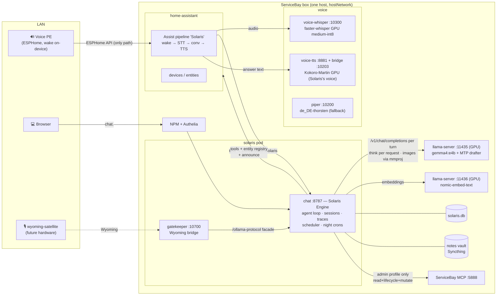
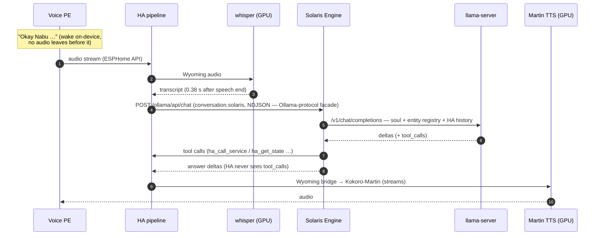
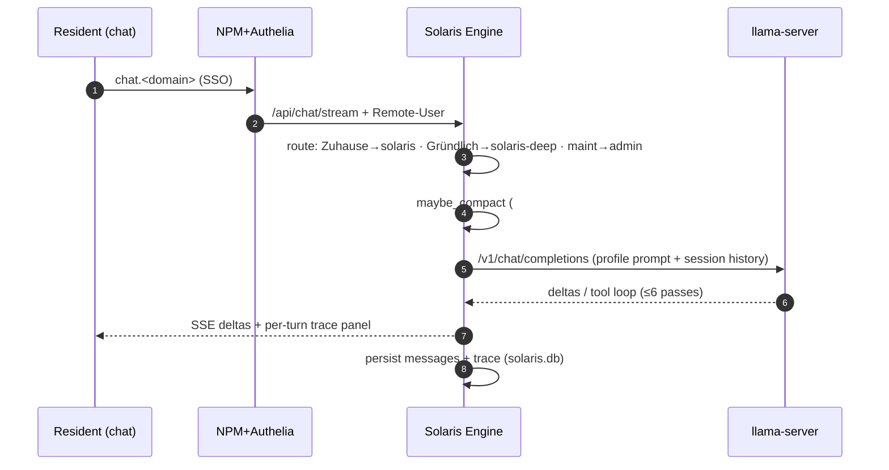
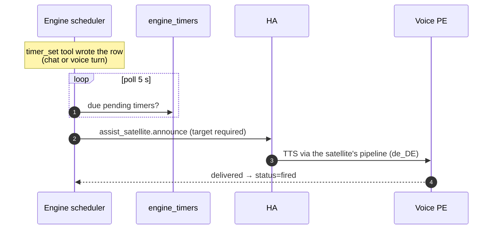

# Solaris architecture

Canonical reference for the Solaris household AI assistant. For the
deployment layout (templates, images, install paths) see
[`README.md`](README.md).

---

## 1. Inference engine

**llama.cpp `llama-server`** on the box (RTX 2000 Ada 16 GB), loopback +
pod-reachable on `:11435`, OpenAI-compatible (`/v1/chat/completions`,
`/props`, `/slots`). It replaced Ollama on the chat path in #1318 for one
reason Ollama cannot do at all: speculative decoding against Google's
Multi-Token-Prediction (MTP) drafter for Gemma 4, box-measured to halve the
per-answer wait (0.62 s → 0.30 s, same weights/prompt/28 generations,
#1317/#1318). See [`templates/llama/README.md`](templates/llama/README.md)
for the server's config, the GPU-passthrough traps, and the on-box-only
access rule.

The engine runs **one household model**, `gemma4:e4b` + the MTP drafter +
mmproj (vision), `think=false` by default. There is no resident e2b/12b pair
any more — 12b was retired 2026-07-13 (it does not fit shared with e4b,
whisper, Kokoro-TTS and the embedder on this 16 GB card) and e2b never beat
e4b enough to justify a second resident model once MTP made e4b itself fast.
"Model and thinking are per-turn parameters" (below) now means: which
*profile* asks, not which of several resident models answers.

**One server in router mode, four presets, the client picks** (#1416). One
llama-server holds every preset on `:11435` and loads the one a request's
`model` field names, evicting the idle child. The GPU lease
(`${DATA_DIR}/solarisbay/gpu-lease.py`) therefore no longer swaps the server:
a named mode sets the *environment* and writes `allowed`, the presets a client
may ask for while it stands.

| Mode (lease) | Preset Solaris answers from | Allowed presets | Who uses it |
|---|---|---|---|
| Household (no lease) | `gemma-4-e4b` + MTP + mmproj, 32k f16 | `gemma-4-e4b` | Solaris chat/voice — the default the box idles at |
| `foundry` | `gemma-4-12b` + MTP, 131k q8 KV | `gemma-4-e4b`, `gemma-4-12b` | foundry-chronicle's evening runs; voice stack stays on the GPU |
| `thinking` | `qwen3.6-35b-a3b` + MTP, 131k q8 KV | `qwen3.6-35b-a3b` | reading and logic; voice stack moves to the CPU, Solaris keeps answering and thinks per request |
| `coding` | `qwen3.8-27b` + MTP, 82k | `qwen3.8-27b` | the coding assistant; voice stack to the CPU, embeddings server stopped |
| exclusive (no `--model`) | — | — | everything stops and Solaris says so |

`--reasoning off` is gone with the swap: one server serves four models, so
thinking is the per-request switch (`chat_template_kwargs.enable_thinking`) the
Engine sends — `true` in `thinking`, `false` everywhere else. A client that
sends neither sets it itself.

A neighbour asks for a profile over HTTP, never by running the lease script
itself: `POST/GET/DELETE http://127.0.0.1:8787/api/model-lease` (loopback,
no token; contract mdopp/foundry-chronicle#321,
`solaris_chat.model_lease`) — `{"model": "foundry", "ttl_s": 900}` →
`200 ready` with an `alias`, or `202 preparing` with `retry_after` to poll;
`409 held` if someone else holds it — that refusal also names the standing
`mode` and its `allowed` presets (#1416), so a caller can use the router
instead of only learning it cannot have the card; no `DELETE` and the lease
just expires back to household. An optional `holder` (#1347) names the *service* asking —
one permanent name like `foundry-chronicle`, never a session or a group — so
`GET` says whose window is open and `DELETE {"holder": ...}` closes only that
one; a bodyless `DELETE` stays the operator's unconditional way out. **The `model` field of every `/v1` response carries the
alias of what is actually loaded** — a consumer reads its model from the
response, never from its own setting, because the lease can swap under it.

**Who may reach `:11435`.** llama-server ships no auth, so the rule is
on-box only, never the LAN: host-networked services (the Solaris Engine,
post-deploy, the health check) use `http://127.0.0.1:11435`; isolated pods
without host networking (e.g. claude-dev) use
`http://host.containers.internal:11435`; nobody gets the LAN IP
(mdopp/solarisbay#1344, an ADR-0007 carve-out — see
[`templates/llama/README.md`](templates/llama/README.md) for the nftables
enforcement).

Box bench 2026-06-12 (`solaris-chat/scripts/bench_models.py`, think=false, 3
runs) — **historical, Ollama-era, three resident models, superseded by the
single-model llama-server design above:**

| Model | wall p50 | wall p95 | TTFT p50 | tool accuracy |
|---|---|---|---|---|
| e2b | 0.72 s | 1.04 s | 0.78 s | 18/18 |
| e4b | 0.90 s | 1.39 s | 0.97 s | 18/18 |
| 12b | 1.57 s | 2.51 s | 1.54 s | 18/18 |

**Those latencies, and the 2026-08-03 baseline in #1120, were measured with the
bench's old hand-written prompt: 1355 tokens, a household that does not exist.**
The bench now derives its prompt from the production assembly instead — the real
household toolbox, the shipped soul, the real registry renderer over a 51-entity
house — which comes to ~7.5k estimated tokens, in the band of the ~7.8k measured
below (#1149). Read new numbers against that; the older tables are optimistic
and want re-measuring before they carry a decision. The current reference
measurement is the llama-server + MTP run in
[`docs/features/chat-and-voice.md`](docs/features/chat-and-voice.md)
("Latency baseline"), not the table above.

**Model and thinking are per-turn parameters** of the Solaris Engine (the
in-process agent core that replaced the Hermes gateways): every profile asks
llama-server for its model by name and its own `think` flag on each request.
No gateway indirection, no per-session model binding.

Context window: 32 768 tokens (`LLAMA_CONTEXT_LENGTH=32768`, fixed at load —
unlike Ollama this is not a per-request hint). The earlier 131k window
existed only because the Hermes-era base prompt had grown to ~25k tokens; the
engine's ≤3k prompt leaves ~29k conversation room.

Speculative decoding / MTP was judged unattainable on the CUDA/GGUF stack in
#189 — **that finding is superseded by #1317/#1318**: llama-server's
`--spec-type draft-mtp` does it, box-measured above, and it is what runs
today.

**Embeddings and vision ingest moved too, in solarisbay#1332 — Ollama is gone
from this box.** `nomic-embed-text` runs on a second, small `llama-server
--embeddings` instance (`:11436`, ~300 MB, its own `llama-embed.service`), so
it never competes for the chat server's generation slot; it drives the OKF
semantic search — the drain worker fills `okf_vectors`, and `notes_search`
does numpy cosine top-k over it. The stored vectors survived the move
unchanged: same v1.5 f16 weights, same mean pooling, same **raw** text (Ollama
never applied nomic's `search_document:`/`search_query:` prefixes, and neither
does this), so nothing had to be re-embedded. Photo and document descriptions
go through the household model's multimodal projector, which is already
loaded. See
[`docs/features/knowledge-system.md`](docs/features/knowledge-system.md).

---

## 2. The Solaris Engine (Hermes fully replaced)

Decision 2026-06-11: Hermes was a generic multi-platform agent framework;
Solaris needs a narrow, latency-critical household agent. Measured on the
box, the Hermes household prefill was 12,689 tokens p50 (66% tool
definitions) and the workaround stack (mutating trace proxy, 3-gateway
construct, `.no-bundled-skills`, config-agent sidecar, 2,800-line
post-deploy) grew with every feature. The system was not live, so Hermes
was replaced **outright** — no strangler.

The engine is a module inside `solaris-chat`
(`src/solaris_chat/engine/`): one process owns turn, loop and capture.

- **Agent loop** directly on llama-server `/v1/chat/completions` (streaming,
  tool dispatch, ≤6 passes — the only backend since #1332). Model + thinking
  are **per turn**; a
  "profile" is a constructor call (`household` = `gemma4:e4b`/no-think +
  registry, `solaris-deep` = `gemma4:e4b`/think + registry, `admin` =
  `gemma4:e4b` + operator prompt + `servicebay_admin` MCP) — what used to be
  a container-and-port.
- **Prompt assembly per profile**: soul (mtime-cached file) + skill
  markdown + the **HA entity registry** (controllable domains,
  `entity_id | name | area`, NO live state — HA Assist's own approach,
  saves the list-entities pass) + per-session overlay. Household prefill:
  ~7.8k tokens, box-measured 2026-08-03 on a household turn against the live
  HA registry (34 tools, 51 injected entities; was 12.7k Hermes-era).
  Every prompt assembly attributes it to tools/soul/registry/scaffold in an
  `engine.prompt.composition` log line (#1138), so a regression is traceable
  to the block that caused it.
- **Tools** are hand-written and token-lean: `ha_call_service` /
  `ha_get_state` / `ha_list_entities`, `timer_set/list/cancel`,
  `notes_search` / `notes_read` / `note_write` / `fact_store`, and
  `calendar_create`, which writes the VEVENT straight to Radicale through the
  engine's own `dav_client` rather than through HA — HA is the way to devices,
  but for a data store Solaris already speaks to, its own client is the way
  (ADR-09, #1125). Web search is
  NOT one of them — it moves to Hermes (ADR-09, #1122). The notes tools are the
  retrieval seam future Immich/CalDAV retrievers plug into (§3).
- **Sessions** live in `solaris.db` (`engine_sessions`/`engine_messages`,
  ownership a plain column — the `[uid:]` title-marker era is over).
- **Native tracing**: every llama-server call recorded at the call site,
  same ring/detail/`session_traces` shapes as the retired proxy; calls carry
  the session id directly (no wall-clock correlation).
- **Scheduler**: timers/alarms/reminders in `engine_timers`; firing rings
  the Voice PE via HA `assist_satellite.announce` (target required —
  box-verified). HA stays the device tool; the schedule lives here.
- **Night crons** (daily-chronicle 23:59, problem-summarizer Mo 04:30,
  chat-compactor 04:15) are code-defined jobs on the deep profile with
  durable last-run stamps (`engine_cron_runs`) — idempotent by
  construction; first boot baselines instead of back-running.

### System picture

GPU budget (16.4 GB): e4b + MTP drafter + mmproj + nomic resident, whisper
medium-int8 ≈ 1.1 GB, Kokoro-Martin TTS ≈ 1.2 GB — everything stays loaded,
no eviction churn (watch this headroom). The e2b+12b dual-resident budget in
the earlier design is history; §1 has the current split.

### Voice (the PE speaker path)

The Voice PE is an ESPHome device that speaks only to HA, so the path is
**Speaker → HA Assist pipeline → Solaris → HA → Speaker**. HA 2026.6's
`openai_conversation` has no custom base_url; its **`ollama` integration**
takes a free URL + Bearer api_key — so the engine exposes an
**Ollama-protocol facade** (`/ollama/api/tags`, `/ollama/api/chat`) —
a compatibility surface for HA, not a dependency on Ollama itself — and
is wired as the Assist conversation agent (`conversation.solaris`, model
`solaris`). The post-deploy registers wyoming whisper/piper, creates the
entry + conversation subentry and the "Solaris" pipeline, sets it preferred
and assigns the PE's pipeline select. The facade is stateless: HA owns
the conversation history; the engine folds HA's prompt after its own
system block and runs its tool loop server-side (HA never sees
tool_calls). The **voice-gatekeeper** speaks the same facade
(`stream:false`, rolling per-conversation history) for wyoming-satellite
hardware.

Measured end-to-end (real spoken turns + live bench, 2026-06-12) —
**historical, Ollama e2b-era; the current reference measurement is the
llama-server + MTP run in
[`docs/features/chat-and-voice.md`](docs/features/chat-and-voice.md)
("Latency baseline"), box run 2026-09-06 at total p50 0.43 s:**

| Segment | Measured |
|---|---|
| speech end → transcript (GPU medium-int8) | **0.38 s** (CPU base was 0.76–2.86 s) |
| TTS first audio (Kokoro-Martin GPU) | **0.03–0.36 s** (picked by ear over piper, servicebay#1815) |
| transcript → Solaris answer complete (e2b, warm) | 0.88–1.0 s |
| facade TTFT plain / tool turn | 0.5–0.75 s / 1.3 s |
| **speech end → answer ready** | **≈ 1.3–1.4 s** (gate ≤ 3 s) |

Whisper runs as the `voice-whisper.container` Quadlet on the GPU
(servicebay#1809: kube play drops CDI devices, so the STT container left
the pod — the same `.container` fixup both llama-server instances need).
gemma4 advertises an `audio` capability but llama-server's chat API does not
accept audio today
(solarisbay#337), so the dedicated STT stage stays — it is also what makes
mishearings visible in traces. The one-pass audio design (audio + "return a
transcript field") is parked on the gatekeeper path until a backend wires
audio input.

### Other flows

Night crons and admin ride the same engine: `CronRunner` polls
`engine_cron_runs` slots (local time) and runs daily-chronicle /
problem-summarizer as ephemeral 12b turns whose output is `note_write`
into the vault; chat-compactor walks stale long sessions through
`compaction.compact_session(force=True)`. The admin persona is the
maintenance embed's profile — operator soul + admin skills as prompt,
ServiceBay MCP tools fetched lazily per turn from :5888 with the minted
token file.

### Routing

- Chat surface: pinned Zuhause + household topic → `household` (e2b);
  "Solaris Gründlich" persona / thorough preference → `solaris-deep` (12b); the
  `?persona=servicebay-maintenance` embed → `admin`, gated on
  Remote-Groups∋admins at the router.
- The admin profile is the only one carrying `servicebay_admin` (token
  scopes read+lifecycle+mutate, no destroy/exec; minted by the post-deploy
  into `<DATA_DIR>/solarisbay/sb-admin-token`, read lazily per connection).
- Voice (facade) defaults to `solaris`; an explicit "think harder" cue routes
  the gatekeeper to `solaris-deep`.

What stays per turn in the chat server: speed → think (#222/#278), topic
binding + `#topic/<slug>` hint (#241/#243), pinned Zuhause (#237),
`[Aktuelle Zeit]` injection (#265), incognito guard (#246), compaction
(#210 — per-turn hard cap + the nightly stale-chat pass).

---

## 3. Knowledge architecture (4 layers, CQRS)

Reads go to the right layer; writes and actions flow via MCP/API (CQRS).
The write side is fixed by the [OKF write contract](docs/okf-write-contract.md)
(frozen 2026-06-15); the read/curation side — retrieval, Stenograph capture,
Bibliothekar curation — is defined in the
[Solaris concept](docs/solaris-concept.md) §3.

| Layer | Store | Status |
|---|---|---|
| **L1 — episodic / user facts** | dated fact files in the vault (`fact_store` tool + nightly Stenograph extraction) + `okf_vectors` semantic index in `solaris.db`, drained from the OKF embedding queue (`nomic-embed-text`) | active |
| **L2 — freeform text** | Obsidian notes vault (`/opt/data/notes`, Syncthing) + unified `notes_search` tool (fuzzy + entity/alias + date-range events + semantic top-k) | active |
| **L3 — structured knowledge** | `solaris.db` OKF projection — `entities`, `entity_aliases`, `facts`, `events`, `event_entities`, `concepts`, `ingest_log` (migration 0016) + `okf_vectors` (0018), rebuildable from the OKF files under `notes/okf/`; fed by the `engine/ingest/` adapters (Obsidian, messenger exports, Immich, CalDAV/CardDAV, Jellyfin music, per-person IMAP) | active |
| **L4 — live device state** | HA-native `ha_*` tools | active |

The former Hermes-native `holographic` provider (the original L1) was removed
with Hermes (§2); nothing episodic survived it — L1 was rebuilt on the OKF
pipeline as described above. The full read/curation loop (Stenograph capture,
Bibliothekar curation, semantic retrieval, the ingest adapters) is documented
in [`docs/features/knowledge-system.md`](docs/features/knowledge-system.md) and
[`docs/features/ingest.md`](docs/features/ingest.md).

The `solaris.db` schema is managed by Alembic migrations in `database/`
(hand-rolled SQL via `op.execute`; portable to Postgres if the graph layer
ever calls for it). See [`database/README.md`](database/README.md) for the
migration runbook.

---

## 4. Topics / Contexts

A **Topic** is a cross-cutting, persistent label that groups a theme, project,
or context across chats, notes, and future graph nodes.

> **Pivot (#279) — user-facing tagging is mention-based, not a picker.**
> The structured **Thema topic-picker** built in #241/#242 is *retired* as the
> user-facing entry point: the topic list couldn't be user-edited and residents
> don't want to curate a fixed list. It is replaced by inline **`#tag`**
> (tags) and **`@person`** (persons) mentions typed directly in the chat. The
> **system topic *binding* stays internal** — the Zuhause chat still runs on
> `gemma4:e2b` + the household soul (now via the household **profile**, §2,
> not a per-session topic override), the `topics` table and its
> `household` / `servicebay-admin` system rows remain as internal plumbing. Only
> the *user-facing picker* is replaced. The split is explicit: **internal
> binding** (D2, unchanged) vs **user-facing tagging** (mentions, below). The
> picker-era design that follows is kept as history and marked
> **superseded-by-#279** where it described the retired user surface.

### Built-in topics

| Topic slug | Type | Model | Persona |
|---|---|---|---|
| `household` | system | e2b | household soul |
| `servicebay-admin` | system | 12b | admin soul |

### User topics (examples)

`finanzen`, `daggerheart`, `krankenkasse`, `arbeit`,
`projekt/wintergarten`, `projekt/garagenumbau`, …

### Operator decisions

**D1 — one primary topic per chat.**
A chat has exactly one *primary* topic and may carry any number of *secondary*
tags. This keeps routing and persona assignment deterministic.

**D2 — a topic carries a primary model + persona.** *(model/persona override
superseded-by-#293 — see §2.)*
Originally, assigning a topic to a chat set the chat's default model and persona
via the topic's `default_model` / `default_persona` columns, injected by the
proxy at session create. **#293 retired that override:** the household gateway's
profile now owns the model + soul, so the proxy no longer injects a per-session
model override or persona overlay (the topic columns stay in the schema but are
no longer consulted at create). What survives of D2 is the **topic binding as a
tag**: a chat started under a topic is persisted as its primary assignment and
its turns get the `#topic/<slug>` context hint (#241/#242), routing ingestion —
it just no longer changes the model/persona, which the profile pins.

*Binding is at session create.* Hermes binds model + system_prompt only when a
session is born (the latency bundle — the model can't switch per-turn). Post-#293
the **profile** supplies both at create; the proxy passes neither. Changing the
primary topic on an **existing** session still updates the chip/label and future
`#topic/` ingestion tags but reuses the same Hermes session (one create), so it
never rebinds the live session — the #242 limitation, now moot for model/persona
since those are profile-owned.

**D3 — scope default is per-resident.**
Per-resident isolation is the baseline (#153). A topic can be widened to
*shared* (household, accessible to all residents) or *admin*.

**D4 — topic creation is suggested AND manual.**
Solaris detects a recurring theme mid-conversation and asks "Soll ich das als
eigenes Topic anlegen?" Manual creation is always available.

### Schema

**`topics` table** (registry, in `solaris.db`):

| Column | Type | Notes |
|---|---|---|
| `slug` | TEXT PK | e.g. `projekt/wintergarten` |
| `display_name` | TEXT | Human label |
| `parent` | TEXT FK→topics | Hierarchy: `projekt/wintergarten` → parent `projekt` |
| `scope` | TEXT | `resident` / `shared` / `admin` |
| `owner_uid` | TEXT | LLDAP uid; null for system topics |
| `default_model` | TEXT | `e2b` / `12b` / null (inherits) |
| `default_persona` | TEXT | Soul slug or null |
| `color` | TEXT | Hex accent for the UI chip |
| `archived` | INTEGER | 0/1 |

**`session_topics` table** (chat↔topic assignment):

| Column | Type | Notes |
|---|---|---|
| `session_id` | TEXT FK | Hermes session id |
| `topic_slug` | TEXT FK→topics | |
| `role` | TEXT | `primary` / `secondary` |
| `owner_uid` | TEXT | Resident who assigned it |

### UI surfaces (picker era — superseded-by-#279)

These were the #241/#242 user surfaces. The **Topic picker** is *retired* by
#279 (replaced by §"Mention-based tagging" below); the chip and pinned-chat
surfaces survive in spirit (the tag-cloud and the Zuhause pin).

- ~~**Topic picker** in the chat header (alongside Schnell/Gründlich and
  persona selector).~~ — *retired (#279); replaced by inline `#tag`/`@person`
  mentions + the tag-cloud.*
- **Topic chip** in the session list (visual at-a-glance).
- **Pinned topic-chats** in the rail — pre-assigned topic + model/persona
  (the #237 pattern extended to user topics).

### Mention-based tagging (#279 — replaces the picker)

The user-facing surface is now **inline mentions** typed in the chat, not a
header picker:

- **`#tag`** — a free-form tag. **`@person`** — a person reference. Both are
  parsed out of the message text as the resident types.
- **Autosuggest while typing.** Typing `#` or `@` opens an autosuggest popover
  (the existing slash-menu pattern). `#` suggests from **already-known tags**
  (tags used before); `@` suggests from **known persons**. *Decision: build
  both `#tags` and `@persons` now* — `@person` suggestions are seeded from
  residents / the uid registry plus a manual list. CardDAV/contacts enrichment
  (#207, parked behind gbrain) extends the person suggestions *later* when it
  lands; the mention surface ships without waiting for it.
- **Tag-cloud.** The tags and persons used in a chat render as a cloud **to the
  right of the chat on desktop** (when there's room) **or as a small line
  directly above the message input** otherwise (responsive). Each tag/person in
  the cloud **links back to the message where it was used** (jump-to-message
  anchor).

**Internal vs user-facing.** This replaces only the *user-facing picker*. The
system topic **binding** (D2) survives as the internal primary-tag + context
hint: the Zuhause chat still runs `gemma4:e2b` + the household soul (now via the
household **profile**, §2 — not a per-session topic override, superseded-by-#293),
and the `topics` table keeps its system rows (`household`, `servicebay-admin`)
as internal plumbing — residents simply never pick from a topic list anymore.

**Storage (open — child units decide).** Where mentions are persisted per
chat + per message is left open by this note: either a dedicated **`tags`
table** (+ a per-message tag/person link), or **repurposing `session_topics`**
with a per-message tag link alongside it. This is a design note; the builder of
the child units picks the specifics.

**Planned decomposition (#279 child units).** This note unblocks the build,
which #279 splits into:

1. **`#tag` parse + autosuggest + store** — parse `#` mentions, suggest from
   known tags, persist them.
2. **Tag-cloud UI + jump-to-message** — the responsive cloud (desktop-right /
   mobile-line) with jump-to-message anchors.
3. **`@person` parse + seed + autosuggest** — parse `@` mentions, seed persons
   from residents / a manual list, suggest from known persons.
4. **Retire the Thema picker** — remove the `#topic-control` picker + the
   `FIXED_CONTEXT_TOPICS` gating (#274); the internal binding stays.

### Data → topic tagging (the heart of the system)

Every ingestion from a topic-T chat auto-stamps `#topic/<slug>`:

| Ingestion path | Tag mechanism |
|---|---|
| Notes (media-ingestion-multimodal, dynamic-skills facts, daily-chronicle) | Frontmatter `#tags:` — these already write `#tags`; the active topic tag is appended |
| Future Immich photos | Topic album |
| Holographic facts (L1) | Topic metadata field |
| Future `solaris.db` L3 records | `topic` column / graph edge |

Mechanism: the proxy injects the active topic slug into each turn's system
context. Any ingestion skill that runs during that turn reads it and stamps
`#topic/<slug>`.

### Retrieval

- `notes-search` filtered by `#topic/<slug>` (works today once tagging lands).
- **Topic dashboard**: all notes, images, facts, and events for a topic in one
  view.
- Future: graph query by topic label (gbrain v0.43+).

---

## 5. Temporary / Incognito chats

Ephemeral by default: no durable session persistence, no auto-ingestion, no
memory/learning writes, no compaction. The session is deleted on close — like
browser incognito.

**Retroactive selective persistence** — the escape hatch: mid-conversation the
resident can say "Erstelle hieraus eine Notiz im Topic Finanzen." The proxy
reads the live context, writes exactly that note (tagged with the chosen topic)
via the normal ingestion path, and leaves everything else ephemeral.

| Property | Ephemeral session | Normal session |
|---|---|---|
| Compaction | skipped | runs at ~90–95% context |
| Auto-ingestion | skipped | active |
| Memory/learning writes | skipped | active |
| Explicit "extract to note" | available | n/a |
| Session on close | deleted | persisted |

Mechanism: an ephemeral flag on the session (carried in the `[temp:]` title
marker alongside the topic markers); the proxy checks it before every write
path. The incognito `[temp:]` prefix + the per-turn guard hint are retained as a
per-session lever after the #293 overlay simplification (§2) — the profile owns
the soul, but incognito is still the proxy's.

---

## 6. Phasing

**v1 (no gbrain dependency):**
Topics registry + `session_topics` + per-topic primary-tag binding (model/persona
now profile-owned, §2, superseded-by-#293) +
auto-`#topic/` tagging + topic-filtered notes-search + topic suggestion +
temporary/incognito chats. The user-facing **topic picker** (#241/#242) is
*superseded by #279* — replaced by inline `#tag`/`@person` mentions +
autosuggest + the tag-cloud (see §3 "Mention-based tagging"); the internal topic
bindings stay.

**v2 (gbrain v0.43+):**
Topics become first-class graph nodes/labels. Chat→topic and data→topic
assignments become typed edges. Cross-source topic retrieval runs over the
graph. The v1 `#topic/<slug>` tags map 1:1 to graph labels — forward-compatible,
no migration of tagged notes required.

---

## 7. Cross-cutting constraints

- **Per-resident isolation** (#153) — session ownership, topic scope, and data
  writes are all resident-scoped by default.
- **Pinned-persona / marker pattern** (#229/#237) — topic assignment reuses the
  same session-marker mechanism as persona pinning. Post-#293 (§2) the soul is
  pinned by the gateway **profile**, not a per-session overlay; the marker
  pattern persists for topic + incognito tagging.
- **Notes `#tag` mechanism** — already used by media-ingestion, dynamic-skills,
  and daily-chronicle; topic tagging extends it without a new convention.
- **Minimal knobs** — one global/automatic mechanism per concern, not per-feature
  toggles. Topic routing and ephemeral flags follow this principle.
